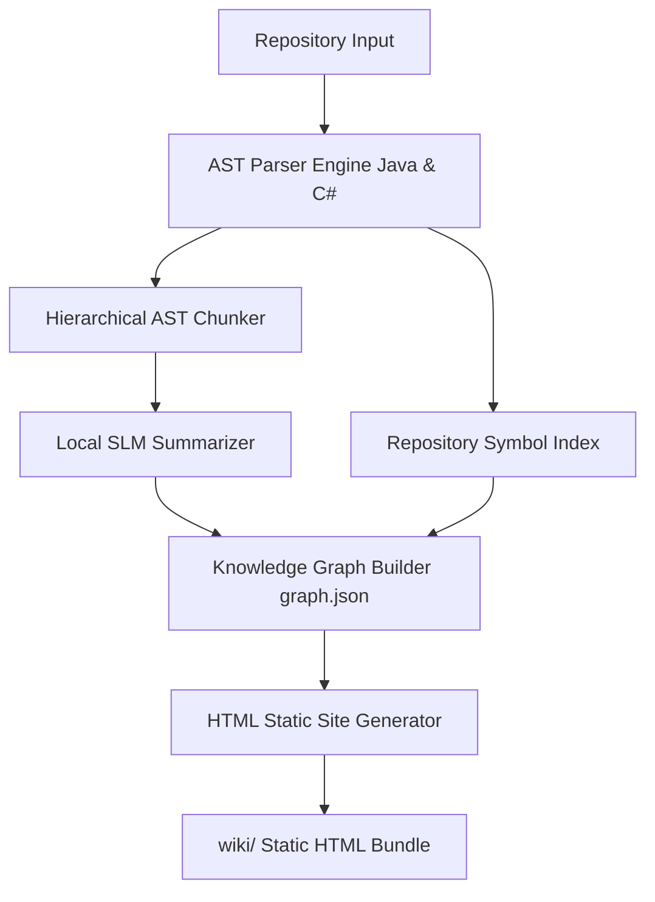
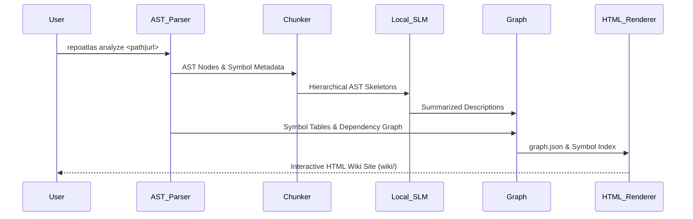

# RepoAtlas — Architecture

## Preamble

This document describes both the current state of the repository and the intended system architecture. At present, RepoAtlas contains project scaffolding and documentation only. Components that have not yet been implemented are identified as planned architecture.

---

## 1. System Overview

### Current State

The repository currently contains:

- Project scaffolding
- Documentation
- Vendored research resources
- Vendored prompt templates

No runtime components or application logic have been implemented.

### Target Architecture

```text
Repository Input
        │
        ▼
Repository Analysis
(scan_structure, save_structure,
 parse_java_ast, parse_csharp_ast)
        │
        ▼
Hierarchical AST Chunker (6-Tier Taxonomy)
        │
        ▼
Local SLM Bottom-Up Summarizer
        │
        ▼
Knowledge Graph (graph.json)
        │
        ▼
HTML Static Site Generator
        │
        ▼
wiki/ Static Site Bundle (index.html, tech.html, architecture.html, etc.)
```



---

## 2. High-Level Architecture

| Directory       | Responsibility                                       |
| --------------- | ---------------------------------------------------- |
| `repositories/` | Temporary repository checkout and analysis workspace |
| `indexes/`      | AST repository metadata and symbol tables           |
| `graphs/`       | Knowledge graph (`graph.json`)                       |
| `agents/`       | Hierarchical SLM summarization logic & prompt templates |
| `wiki/`         | Generated interactive HTML static website output     |
| `output/`       | Exported analysis artifacts                          |
| `templates/`    | HTML Handlebars/Jinja layout & prompt templates      |

---

## 3. Component Architecture

The target architecture consists of seven core components:

- **Input Component** — Accepts repository paths or Git URLs.
- **AST Parser Subsystem** — Parses Java (`JavaParser`) and C# (`Roslyn`) into normalized AST nodes.
- **Repository Indexer** — Maintains symbol lookup tables and dependency call graphs.
- **Hierarchical Chunker** — Structures AST nodes along the 6-tier taxonomy (`Repository → Module → Container → Component → Class → Method`).
- **SLM Summarizer Engine** — Performs bottom-up summarization using local SLMs guided by AST skeletons.
- **Graph Builder** — Produces the persistent `graph.json` knowledge graph.
- **HTML Static Site Renderer** — Generates an interactive static HTML website (`wiki/`) with sidebar trees, breadcrumbs, search, and dynamic symbol cross-links.

---

## 4. Module Architecture

```text
Input ──► AST Parser Engine ──► Indexer & Chunker ──► Local SLM ──► Graph Builder ──► HTML Renderer
```

---

## 5. Deployment

RepoAtlas is designed as a standalone CLI application.

Characteristics include:

- No backend services.
- No long-running processes.
- No database server.
- One execution per analysis request.

An optional local SLM (via Ollama or local inference server) or remote LLM API is used for summarization.

---

## 6. Data Flow



---

## 7. Integration Architecture

External integrations are intentionally minimal.

| Integration    | Purpose                           |
| -------------- | --------------------------------- |
| Git            | Clone remote repositories         |
| Local LLM      | Local documentation summarization |
| Remote LLM API | Optional AI summarization         |

No vector databases, cloud storage, or additional backend services are required.

---

## 8. Cross-Cutting Concerns

| Concern       | Approach                                       |
| ------------- | ---------------------------------------------- |
| Configuration | Repository path and optional LLM configuration |
| Logging       | Console logging                                |
| Security      | Read-only repository analysis                  |
| Testing       | Planned for future implementation              |

---

## 9. Conclusion

RepoAtlas follows a lightweight architecture centered around a single CLI workflow. Repository analysis produces a knowledge graph that serves as the source for generating four documentation files. The system avoids unnecessary infrastructure and emphasizes simplicity, reproducibility, and local execution.
