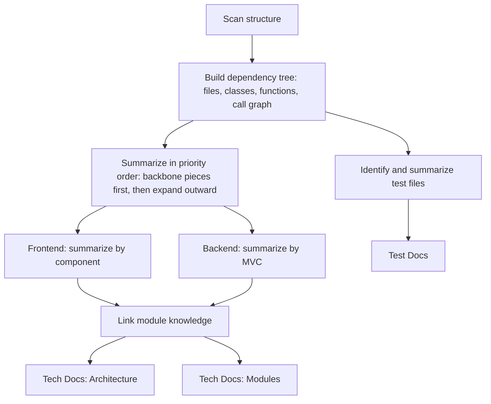

# RepoAtlas — Architecture (Harness & Tools)

## Core idea

Getting an AI to actually understand a large repository — hundreds of files, thousands of functions — doesn't work by summarizing files one at a time in isolation. Systems like LingmaAgent (Alibaba) and RepoUnderstander handle this by building a structural picture of the repository first, then working through it deliberately instead of reading everything in file order. RepoAtlas MVP takes the same approach, scaled down to what's needed to produce Tech Docs and Test Docs.

The pipeline has two phases:

1. **Build the structure** — scan the whole repository, break it into a hierarchy (repo → folder → file → class → function), then add the call relationships between those pieces. This structure is the map that later steps use to decide what to read and in what order, instead of wandering through files aimlessly.
2. **Summarize guided by that structure, bottom-up** — summarize individual functions/classes first, merge those into component/module summaries, then merge those into the overall architecture picture. This mirrors how a summary agent works in practice: it doesn't hold the whole repo in context at once, it keeps building up a description of what each piece does and where it lives, without carrying the raw code forward at every step.

## Toolset (the Harness)

| Tool                                                                         | Input                                         | Output                                                             | What it does                                                                                                                                                                                                        |
| ---------------------------------------------------------------------------- | --------------------------------------------- | ------------------------------------------------------------------ | ------------------------------------------------------------------------------------------------------------------------------------------------------------------------------------------------------------------- |
| `scan_structure`                                                             | repo path                                     | folder/file tree                                                   | Walks the whole project, skipping noise directories (`node_modules`, `.git`, `dist`, etc.)                                                                                                                          |
| `build_dependency_tree`                                                      | folder/file tree                              | hierarchy of file → class → function, plus a call graph            | Parses each file (via AST) into classes and functions, and records which functions call which — this is what replaces "just reading raw files" with something structurally meaningful                               |
| `search_code` (three layers: `search_class`, `search_method`, `search_code`) | a name or keyword                             | the matching class, function, or code snippet                      | Lets later steps look up one specific piece of the repo without re-reading everything, using the tree built above                                                                                                   |
| `summarize`                                                                  | one file, class, function, or a related group | a short summary plus its source location (`file`, `class`, `func`) | Summarizes a single unit of code, always keeping a pointer back to where it came from                                                                                                                               |
| `link_module_knowledge`                                                      | the summaries of the pieces inside one module | one module-level summary                                           | Merges several smaller summaries (components, functions) into one coherent picture of a module — this plays the same role a summary agent plays: keep the description of roles and relationships, drop the raw code |

Every tool returns results with a source location attached (file path, class name, function name), so nothing in the generated docs is disconnected from an actual place in the code.

## Avoiding reading everything

A repository is usually too large to summarize file by file in full. One useful trick, borrowed from how correlation-based expansion works in repo-exploration agents, is to prioritize the parts of the code most connected to everything else — rank by relevance (e.g. how many other files import or call a given piece) rather than walking files alphabetically. RepoAtlas MVP uses a simplified version of that idea:

1. Summarize the files/classes with the most incoming references first — these are usually the backbone of a module.
2. From there, expand outward to directly related pieces (things it calls, or things that call it), instead of summarizing every file in isolation and in an arbitrary order.
3. Stop expanding once a module's role is fully described, rather than trying to feed the whole module's code into the model at once.

## Producing Tech Docs

**Architecture** comes from combining the module-level summaries (the output of `link_module_knowledge`) with the dependency relationships between modules from `build_dependency_tree` — which module imports or calls which. The result is the overall picture: what modules exist, what each one is for, and how they connect.

**Modules** keeps the more detailed, per-module view:

- Frontend modules are described component by component — each component's purpose, its main props/behavior, and which other components it uses.
- Backend modules are described along Model / View / Controller lines (or the equivalent for whatever framework is in use), describing how a request flows through those layers.

## Producing Test Docs

While the structure is being built, test files are identified separately (by path convention — `test/`, `tests/`, `__tests__` — or by the test framework's naming convention). Each test file or group gets summarized: what it checks, and which module it maps back to (cross-referenced against the module tree from the structure-building step). That mapping is what makes Test Docs useful — not just a list of tests, but tests tied to the code they actually protect.

## End-to-end workflow

All of this is wired together through an `AGENTS.md` file that defines the run order:

## Quality control

The MVP doesn't need a dedicated guardrail or policy layer. The bar for this stage is simple: every summary carries a pointer back to real code, and a human reads the output before treating it as final. Adding an automated review pass on top of that is worth revisiting later, once there's enough data to tell whether it actually helps — early attempts at automated review in similar systems have shown it can hurt quality as often as it helps, since an LLM reviewing its own output tends to catch surface-level issues but miss deeper semantic ones.

## Open questions before building this

- Which LLM to use for `summarize` and `link_module_knowledge`.
- A sample set of repositories spanning different languages and architectures to validate the pipeline against before widening scope.
- How to segment a repository for the model — by module rather than by line count, so each call has a complete, meaningful unit of context (a whole class, a whole component) instead of a piece cut off mid-way through.
