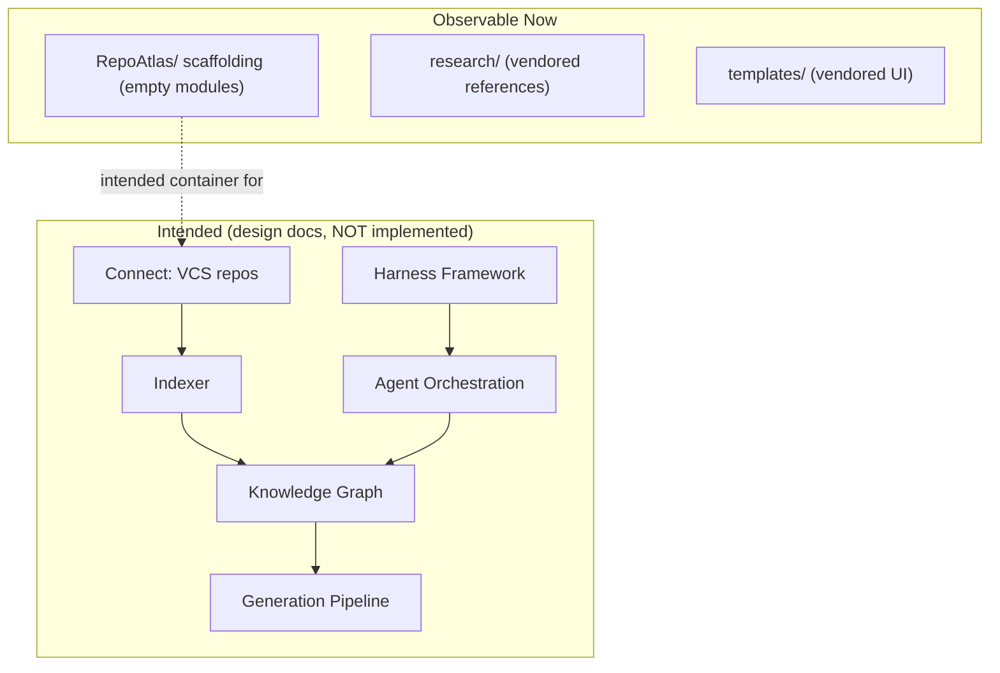
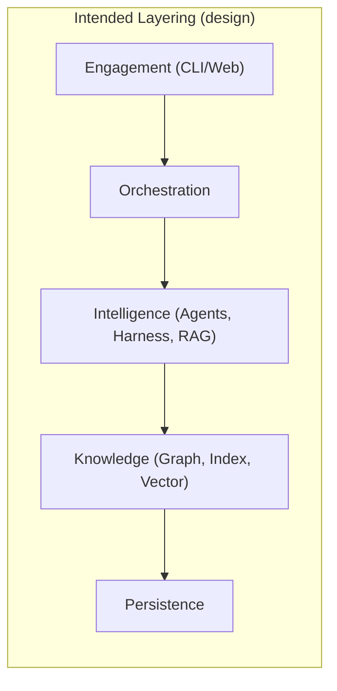
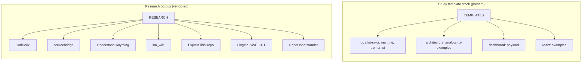
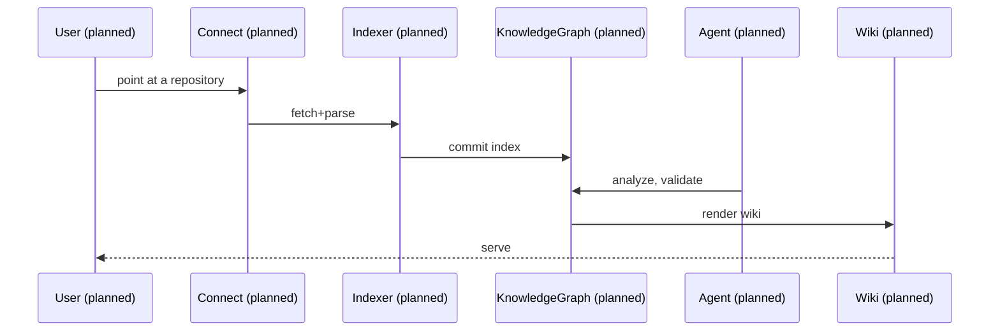
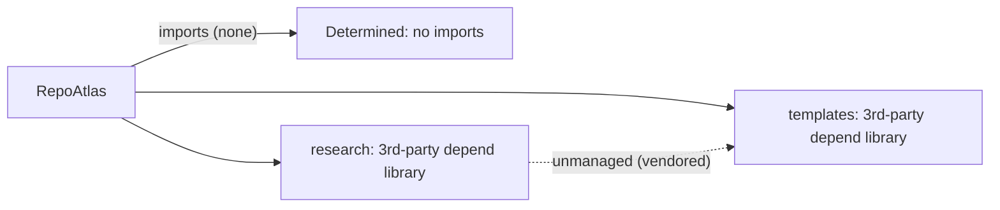

# RepoAtlas — Architecture

## Preamble on Method

This document describes the architecture **as it actually exists** in the workspace. It is grounded in evidence from files and folders; anything not observable is labeled **Not Determined**. Where RepoAtlas has designed-not-built intent, the source of that intent is the authored design docs (`E:\FPT\Wiki Generation\docs\*.md`) and explicit folder names.

---

## 1. System Overview

### Current System (observable)

The system today is **not a runtime platform**. It is a **static workspace aggregation** with two categories of assets and a scaffolding taxonomy:

1. **A declared (empty) product architecture** — seven top-level folders that name the modules RepoAtlas intends to ship.
2. **A vendored asset library** — research references and UI templates used to inform/seed that future product.

There is no running service, no data flow between components, and no consumer-facing surface.

### Intended System (from design docs — Not Yet Built)

Per `docs/system-overview.md`, the intended system is a closed loop:
`Connect → Index → Setup Harness → Analyze → Validate Commit → __→ Generate → Serve → Refresh`.

Since no code realizes this loop, the "system overview" of the platform is documented as **design intent**, not as implemented behavior.



**Determined:** the current system = scaffolding + library. **Not Determined:** all runtime behavior.

---

## 2. High-Level Architecture — Not Determined (as implemented)

No `main`, no services, no binaries — so a high‑level system architecture **cannot be observed**.

The only high‑level decomposition that exists is **the folder taxonomy**, which the design docs interpret for module boundaries:

| Folder | Intended role (inferred from name + design docs) | Status |
|---|---|---|
| `repositories/` | Input: repositories under analysis | Empty |
| `indexes/` | Repository index / search layer | Empty |
| `graphs/` | Knowledge graph layer | Empty |
| `agents/` | Agent/orchestration layer | Empty |
| `harnesses/` → **none** | (no such folder exists) | **Not Determined** |
| `packages/` | Shared packages/modules | Empty |
| `wiki/` | Generated wiki artifacts | Empty |
| `output/` | Other generated artifacts | Empty |

The intended architecture (per `system-overview` design) would distribute these into Engagement, Orchestration, Intelligence, Knowledge, and Persistence **layers** — but as **not implemented**, this is captured only as intended design.



---

## 3. Component Architecture — What Actually Exists

The real, present **components** are not RepoAtlas modules but the vendored directories. These are components **of the research/template corpus**, not deployments.



**Determined** — presence and composition of the above. **Not Determined** — any RepoAtlas service components.

---

## 4. Module Architecture — **Not Determined (scaffolding only)**

### Determined: The intended module boundaries (folder names only)

```text
Repositories -> Indexes -> Graphs -> Agents -> Packages -> Wiki/Output
```

### Not Determined

- Any source code, package manifests, or exported modules for RepoAtlas.
- Dependency direction between the intended modules (only implied: `repositories → indexes → graphs → wiki`).

---

## 5. Domain Architecture — Inferred from naming

| Domain | Inferred concern | Evidence |
|---|---|---|
| **Ingestion** | Manage repositories | `repositories/`, `research/projects/` |
| **Indexing** | Extract structured metadata | `indexes/` |
| **Knowledge** | Graph + query | `graphs/` |
| **Automation** | AI agents & orchestration | `agents/` |
| **Content** | Wiki/artifacts | `wiki/`, `output/` |
| **Reuse** | Shared packages | `packages/` |
| **Research** | Reference/intel corpus | `research/` |

---

## 6. Deployment Architecture — **NotDetermined**

- No `Dockerfile`, no CI, no `docker-compose.yml` in the product folders (the vendored `sourcebridge` has its own, but that is third‑party).
- No package metadata (`package.json`, `pyproject.toml`, `go.mod`) **for RepoAtlas itself**.

**Determined:** none of the product is currently deployable as a service.

---

## 7. Runtime Architecture — **NotDetermined**

There is no process, no async runtime, no job queue, no daemon in RepoAtlas. The design docs describe an intended long‑running scheduler/agent loop, but nothing runs today.

---

## 8. Data Flow — **NotDetermined (runtime)**

**Determined:** the intended data flow exists only as a design (`docs/system-overview.md`):

### Intended request/analysis flow (design, not implemented)



This is a **design artifact**, clearly labeled — no actual data moves anywhere yet.

---

## 9. Request Flow — **NotDetermined**

No HTTP/gRPC/CLI endpoints exist in the product code. The design proposes a Gateway/API (`system-overview`), but **no requests are served today**.

**Component/request flow diagram (presenting the design intent only):**

```mermaid
graph LR
    CLI[CLI (design)] --> API[Gateway (design)]
    WEB[Web UI (design)] --> API
    API --> ORCH[Orchestrator (design)]
    ORCH --> AG[Agent Runtime (design)]
    AG --> HK[Harness (design)]
    AG --> KG[Knowledge Graph (design)]
```

Label: *"Proposed design — none of these nodes are implemented."*

---

## 10. Dependency Graph

### Determined — RepoAtlas has no runtime dependencies

`git`-only. No `package.json`, no lockfile, no `requirements.txt` at the product root — the first evidence of "first commit" with files only staged.

### Determined — Vendored corpus has its own deps (unmanaged)

- `sourcebridge`: Go modules + gql generator dependencies.
- `CodeWiki`/`ExplainThisRepo`/`Lingma`...: Python deps.
- `llm_wiki`/`Understand-Anything`/templates: npm/pnpm deps with lockfiles.

(Belong third‑party, not RepoAtlas? They are assets, not dependencies of a RepoAtlas module.)



---

## 11. Integration Architecture — **NotDetermined**

- The product does not integrate with anything (VCS, LLM providers, vector DB, blob store) at code level.
- The research corpus accidentally "integrates" with many third‑party ecosystems (GitHub sources, model endpoints) — but that belongs to the sourced projects, not Repo.

---

## 12. Cross-Cutting Concerns

| Concern | Status |
|---|---|
| Security / Authn / Authz | **NotDetermined** (no surface) |
| Configuration | **NotDetermined** (product) — vendored corpus has its own `.env.example` etc. (3rd‑party) |
| Observability | **NotDetermined** |
| Testing strategy | **NotDetermined** (product tests) — template `tests/` fixtures exist but belong to the vendored `templates/ui/…` test packs |

---

## 13. Conclusion

The material that materially exists is: an empty taxonomy (`repositories → indexes → graphs → agents → packages → wiki/output`), a vendored *research* and *template* library, and my authored design docs. Every architectural sub‑topic that implies a running system — component/module/runtime/deployment/dataflow/dependency/integration/security/testing — is **Not Determined** because there is no code to infer it from. Any future reader should treat the *design* statements (clearly set off with diagrams) as aspirational, and the *observable* statements (folder tree) as factual.