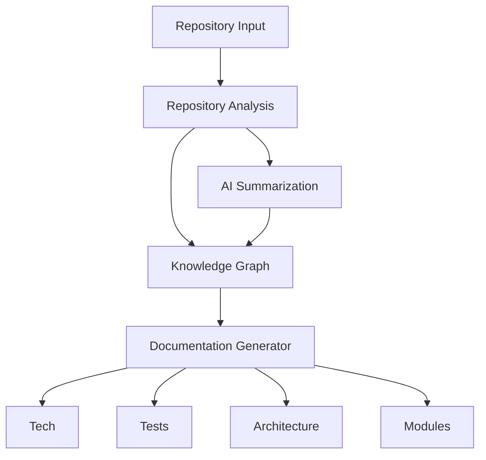
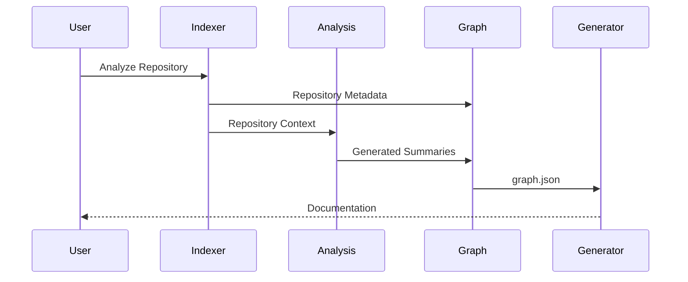

# RepoAtlas — Architecture

## Preamble

This document describes both the current state of the repository and the intended system architecture. At present, RepoAtlas contains project scaffolding and documentation only. Components that have not yet been implemented are identified as planned architecture.

---

## 1. System Overview

### Current State

The repository currently contains:

- Project scaffolding
- Documentation
- Vendored research resources
- Vendored prompt templates

No runtime components or application logic have been implemented.

### Target Architecture

```text
Repository Input
        │
        ▼
Repository Analysis
(scan_structure, save_structure,
 read_file, build_import_graph)
        │
        ▼
AI Summarization (optional)
        │
        ▼
Knowledge Graph
(graph.json)
        │
        ▼
Documentation Generator
        │
        ▼
Tech.md
Tests.md
Architecture.md
Modules.md
```



---

## 2. High-Level Architecture

| Directory       | Responsibility                                       |
| --------------- | ---------------------------------------------------- |
| `repositories/` | Temporary repository checkout and analysis workspace |
| `indexes/`      | Repository metadata generated during analysis        |
| `graphs/`       | Knowledge graph (`graph.json`)                       |
| `agents/`       | AI summarization logic and prompt templates          |
| `wiki/`         | Generated documentation                              |
| `output/`       | Exported analysis artifacts                          |
| `templates/`    | Documentation and prompt templates                   |

---

## 3. Component Architecture

The intended architecture consists of five major components:

- **Input** — Accepts repository paths or Git URLs.
- **Indexer** — Extracts repository metadata and dependency information.
- **Analysis** — Generates repository summaries using an optional LLM.
- **Graph Builder** — Produces the knowledge graph.
- **Generator** — Generates documentation from the graph.

---

## 4. Module Architecture

```text
Input
    │
    ▼
Indexer
    │
    ▼
Analysis
    │
    ▼
Graph Builder
    │
    ▼
Generator
```

Each module performs a single responsibility within the analysis workflow.

---

## 5. Deployment

RepoAtlas is designed as a standalone CLI application.

Characteristics include:

- No backend services.
- No long-running processes.
- No database server.
- One execution per analysis request.

An optional local or remote LLM service may be used during documentation generation.

---

## 6. Data Flow



---

## 7. Integration Architecture

External integrations are intentionally minimal.

| Integration    | Purpose                           |
| -------------- | --------------------------------- |
| Git            | Clone remote repositories         |
| Local LLM      | Local documentation summarization |
| Remote LLM API | Optional AI summarization         |

No vector databases, cloud storage, or additional backend services are required.

---

## 8. Cross-Cutting Concerns

| Concern       | Approach                                       |
| ------------- | ---------------------------------------------- |
| Configuration | Repository path and optional LLM configuration |
| Logging       | Console logging                                |
| Security      | Read-only repository analysis                  |
| Testing       | Planned for future implementation              |

---

## 9. Conclusion

RepoAtlas follows a lightweight architecture centered around a single CLI workflow. Repository analysis produces a knowledge graph that serves as the source for generating four documentation files. The system avoids unnecessary infrastructure and emphasizes simplicity, reproducibility, and local execution.
