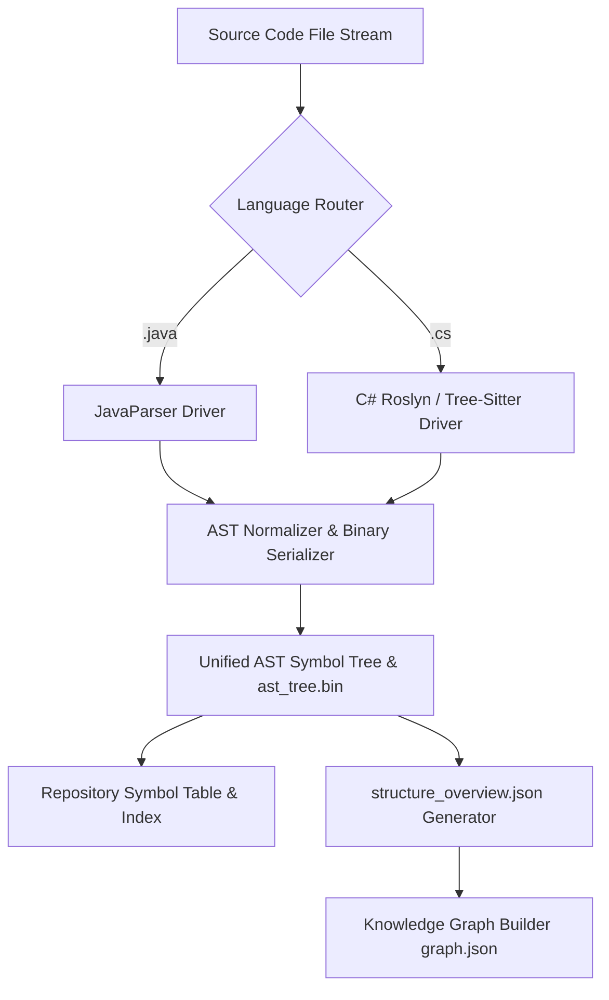
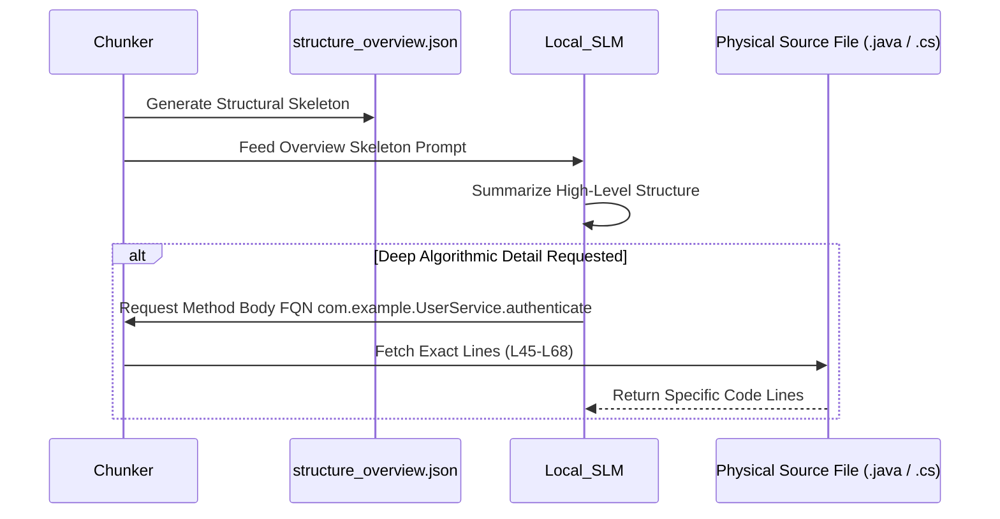

# RepoAtlas — Language-Specific AST Parser Design (Java & C#)

## 1. Motivation & Architectural Goals

The initial text-based heuristic scanner relies on directory scanning, regex-based import graph generation, and raw line reading. In modern object-oriented codebases written in **Java** or **C#**, this approach faces severe limitations:
- **Context Bloat:** Dumping raw source files directly into prompt context window quickly exceeds token limits and causes reasoning failure.
- **Loss of Structural Context:** Regex cannot accurately determine class inheritance, method overriding, generic parameters, or field types.
- **Ambiguous Dependencies:** Importing a package (`import com.example.service.*`) does not reveal which specific classes or methods are used.
- **Lack of Annotations / Attributes Metadata:** Framework annotations (e.g., Spring Boot `@RestController`, `@Service`, or ASP.NET Core `[ApiController]`, `[HttpGet]`) are vital for architectural understanding but invisible to raw line scanners.

### Core Architecture Objectives (Addressing Advisor Feedback)
1. **Never dump full source code into a single context window.**
2. Parse Java (`.java`) and C# (`.cs`) files into language-agnostic **Abstract Syntax Trees (AST)** and serialize them into a compact binary / JSON structural overview index (`structure_overview.json` / `ast_tree.bin`).
3. Print and navigate the structural tree skeleton first for high-level overview summarization.
4. **Lazy Loading on Demand:** Fetch and read raw source file contents *only* when deep method-level algorithmic inspection is required.

---

## 2. AST Subsystem Architecture

The AST Parser Subsystem uses an extensible driver-based architecture (`ASTParserEngine`).



---

## 3. Binary & Compact Structural AST Serialization

To avoid context saturation, the parser generates a binary-compressed structural graph (`ast_tree.bin`) alongside a lightweight skeleton map (`structure_overview.json`).

### Structural Tree Skeleton (`structure_overview.json`)
```json
{
  "repository": "EnterpriseApp",
  "modules": [
    {
      "name": "OrderModule",
      "containers": [
        {
          "name": "Order.API",
          "type": "WebAPI",
          "components": [
            {
              "name": "Controllers",
              "classes": [
                {
                  "fqn": "Com.Company.Order.OrderController",
                  "methods": ["CreateOrder(OrderDto)", "GetOrderStatus(Guid)"]
                }
              ]
            }
          ]
        }
      ]
    }
  ]
}
```

---

## 4. Java Parser Implementation Details

* **Technology Stack:** `JavaParser` (or `tree-sitter-java`).
* **Target Elements:**
  * **Package & Imports:** Package FQN and explicit/wildcard imports.
  * **Type Declarations:** Classes, Interfaces, Enums, Records, and Annotations.
  * **Annotations Metadata:** `@RestController`, `@Service`, `@Autowired`, `@Entity`, `@Test`.
  * **Field Declarations:** Name, type, visibility (`public`, `private`, `protected`), and static/final modifiers.
  * **Method Declarations:** Signature, return type, parameters, thrown exceptions, access modifiers, Javadoc string, and line numbers.

---

## 5. C# Parser Implementation Details

* **Technology Stack:** Microsoft Roslyn (`Microsoft.CodeAnalysis.CSharp`) or `tree-sitter-c-sharp`.
* **Target Elements:**
  * **Namespaces & Usings:** Namespace scope and `using` directives.
  * **Type Declarations:** Classes, Structs, Interfaces, Enums, and Records.
  * **Attributes Metadata:** `[ApiController]`, `[Route]`, `[HttpGet]`, `[Fact]`, `[Key]`.
  * **Properties & Fields:** Property accessors (`{ get; set; }`), backing fields, modifiers.
  * **Method Declarations:** Async modifiers (`async Task<T>`), parameters (`ref`, `out`, `in`), XML documentation comments (`/// <summary>`), and line ranges.

---

## 6. Unified AST Node Schema

All language parser drivers normalize raw AST trees into a standardized JSON representation:

```json
{
  "symbolId": "com.example.auth.UserService.authenticate(String,String)",
  "language": "java",
  "kind": "METHOD",
  "name": "authenticate",
  "fullyQualifiedName": "com.example.auth.UserService.authenticate",
  "filePath": "src/main/java/com/example/auth/UserService.java",
  "range": {
    "startLine": 45,
    "endLine": 68
  },
  "modifiers": [
    "public"
  ],
  "annotations": [
    {
      "name": "Transactional",
      "args": {
        "readOnly": "false"
      }
    }
  ],
  "docstring": "Authenticates user credentials against the repository and returns a JWT token.",
  "parentSymbolId": "com.example.auth.UserService",
  "signature": {
    "returnType": "java.lang.String",
    "parameters": [
      {
        "name": "username",
        "type": "java.lang.String"
      },
      {
        "name": "password",
        "type": "java.lang.String"
      }
    ]
  },
  "dependencies": [
    "com.example.auth.UserRepository",
    "com.example.auth.PasswordEncoder"
  ]
}
```

---

## 7. Repository Index & Symbol Table

The **Repository Index** maintains a centralized dictionary of all code symbols:
1. **FQN Registry:** Fast resolution of any class or method name across the codebase.
2. **Hierarchy Graph:** Class inheritance (`extends`, `implements`), interface contracts, and subclass references.
3. **Call Graph:** Direct invocation edges extracted from method bodies to understand data flow.

---

## 8. Lazy Loading & RAG Integration Workflow



- **Exact Line Bounds:** The index provides exact line ranges for AST nodes.
- **Skeleton Prompting:** Injecting AST signatures into LLM prompts reduces token consumption by up to 70%.
- **Zero Hallucination:** The LLM is forced to reference indexed FQNs when describing relationships.
