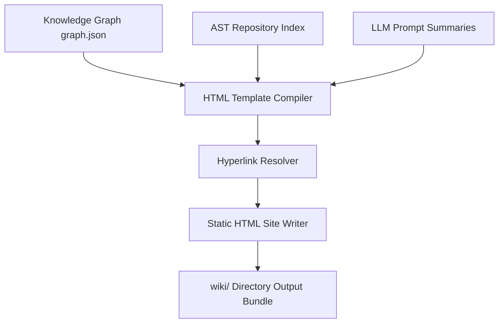

# RepoAtlas — Standardized HTML Wiki Storage Design

## 1. Motivation: Why HTML Over Markdown?

While Markdown is a standard for plain-text documentation, it presents several major drawbacks when used for complex repository wikis:
- **Navigation & Usability:** Flat Markdown files cannot host an interactive directory tree view, sticky navigation header, or dynamic search bar.
- **Fragile Hyperlinking:** Relative Markdown links break easily when rendering across different viewers or when directory depth changes.
- **Visual Presentation:** Markdown lacks native support for collapsible AST signature blocks, tabbed code snippets, or custom theme styling (Dark/Light modes).
- **Self-Contained Distribution:** A compiled HTML static website bundle (`wiki/`) can be viewed locally in any web browser (`file://`) or deployed directly to static hosts (GitHub Pages, Netlify) with full styling and interactivity.

---

## 2. HTML Page Hierarchy

The generated wiki is rendered as a clean, multi-page static web application:

```
                            ┌────────────────────────┐
                            │       index.html       │
                            │  (Master Dashboard)    │
                            └───────────┬────────────┘
                                        │
     ┌──────────────────┬───────────────┴───────────────┬──────────────────┐
     ▼                  ▼                               ▼                  ▼
┌───────────┐     ┌───────────┐                   ┌───────────┐      ┌───────────┐
│ tech.html │     │tests.html │                   │arch.html  │      │modules.html│
└───────────┘     └───────────┘                   └───────────┘      └─────┬─────┘
                                                                           │
                                                                           ▼
                                                                  ┌─────────────────┐
                                                                  │modules/<mod>.html│
                                                                  └────────┬────────┘
                                                                           │
                                                                           ▼
                                                                  ┌─────────────────┐
                                                                  │symbols/<fqn>.html│
                                                                  └─────────────────┘
```

---

## 3. UI Component Architecture

Every HTML page is rendered with a shared, responsive layout containing five key UI components:

1. **Sidebar File/Module Tree:** Collapsible tree navigation reflecting the codebase hierarchy.
2. **Sticky Top Navbar:** Global header containing the project name, live search input, and top-level navigation links (**Tech**, **Tests**, **Architecture**, **Modules**).
3. **Dynamic Breadcrumb Trail:** Header breadcrumb displaying current position (`Repository > Module: auth-service > Class: UserService > Method: authenticate`).
4. **Table of Contents (TOC):** Floating sidebar auto-generated from page headings (`<h2>`, `<h3>`).
5. **Interactive Code & Symbol Blocks:** Code snippets enriched with syntax highlighting (Prism.js) and collapsible AST metadata blocks.

---

## 4. Symbol Hyperlinking & Cross-Referencing

The static site generator transforms raw symbol references into interactive hyperlinks:
- Every type reference in an AST node (e.g., `UserRepository userRepo`) is converted into `<a href="../symbols/com.example.auth.UserRepository.html">UserRepository</a>`.
- Enables two-way navigation between method callers and class definitions across pages.

---

## 5. Directory & Asset Layout

The static website output is stored in `wiki/`:

```
wiki/
├── index.html                  # Wiki Home & Master Executive Summary
├── tech.html                   # Technology Stack, Build Tools, & Dependencies
├── tests.html                  # Test Suites, Coverage Metrics, & Run Guides
├── architecture.html           # High-Level System Architecture & Diagrams
├── assets/
│   ├── css/
│   │   ├── main.css            # Responsive Design System CSS
│   │   └── prism.min.css       # Code Syntax Highlighting CSS
│   └── js/
│       ├── main.js             # Tree View, Search, & Navigation Script
│       ├── prism.min.js        # Syntax Highlighter Library
│       └── mermaid.min.js      # Client-Side Mermaid Diagram Renderer
├── modules/
│   ├── auth-service.html       # Auth Module Documentation
│   └── order-service.html      # Order Module Documentation
└── symbols/
    ├── com.example.auth.UserService.html
    └── com.example.auth.UserRepository.html
```

---

## 6. Rendering Pipeline



1. **Template Loading:** Loads Handlebars/Jinja HTML templates (`page.hbs`, `sidebar.hbs`, `symbol.hbs`).
2. **Hyperlink Resolution:** Scans generated summaries and code snippets, converting raw FQNs into relative `.html` links.
3. **Static Generation:** Writes compiled `.html` pages to `wiki/` and copies CSS/JS assets into `wiki/assets/`.
