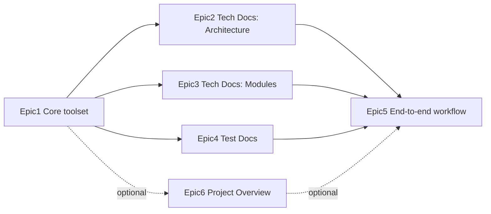

# RepoAtlas — Epics

## Epic 1 — Core toolset

Build the small set of tools everything else depends on: scanning the repo, building the file/class/function structure with its call graph, searching within that structure, summarizing a unit of code, and merging summaries into a module-level picture.

**Done when:**

- `scan_structure` returns a full, clean tree for a sample repo (no vendor/build noise).
- `build_dependency_tree` correctly extracts classes, functions, and call relationships for at least one sample repo per major language in scope.
- `summarize` always returns a source reference alongside its summary.
- `link_module_knowledge` produces a coherent module summary out of several smaller ones.

**Depends on:** picking an LLM.

## Epic 2 — Tech Docs: Architecture

Turn module-level summaries plus the inter-module dependency graph into a single architecture overview.

**Done when:**

- The Architecture doc for a sample repo lists exactly the modules that actually exist — nothing invented, nothing missing.
- It includes a diagram of how the main modules relate to each other.

**Depends on:** Epic 1.

## Epic 3 — Tech Docs: Modules

Produce a detailed, per-module breakdown — components for frontend modules, MVC layers for backend modules.

**Done when:**

- Every module has its own section: purpose, main pieces, related files.
- Frontend modules are broken down by component; backend modules by MVC (or the framework's equivalent).

**Depends on:** Epic 1.

## Epic 4 — Test Docs

Identify the existing test suite and describe what it covers.

**Done when:**

- Every test file in a sample repo is found and listed.
- Each test/test group has a short description of what it checks and which module it belongs to.

**Depends on:** Epic 1.

## Epic 5 — End-to-end workflow

Wire Epics 1–4 into a single pipeline driven by an `AGENTS.md` config, runnable with one command.

**Done when:**

- One run on a sample repo produces both Tech Docs (Architecture + Modules) and Test Docs.
- Re-running on the same repo produces consistent results.

**Depends on:** Epics 1–4.

## Epic 6 (optional) — Project Overview

A short, high-level intro document summarizing what the project is, on top of whatever README/description already exists in the repo.

**Status:** nice to have — safe to skip if it's competing with the two required documents.

**Depends on:** Epic 1.

---

## Dependency graph

MVP is done when Epics 1–5 are done. Epic 6 is a bonus if there's time left.
