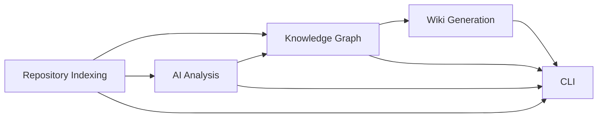

# RepoAtlas — Epics

## Epic 1 — Repository Indexing

### Goal

Analyze a repository from a local path or Git URL and extract its structural information.

### Scope

- `scan_structure`
- `save_structure`
- `read_file`
- `build_import_graph`

### Acceptance Criteria

- The system successfully scans a local repository or Git repository.
- A directory and file structure is generated.
- An import graph is created from the source code.
- Repository structure is saved locally for use during the current analysis.

### Dependencies

None.

---

## Epic 2 — Knowledge Graph

### Goal

Build a knowledge graph from the repository metadata and persist it as `graph.json`.

### Acceptance Criteria

- A `graph.json` file is generated from repository metadata.
- Repository entities and relationships are represented in the graph.
- Basic relationship queries can be performed using the generated graph.
- Running the analysis again completely regenerates the knowledge graph.

### Dependencies

Epic 1.

---

## Epic 3 — AI Analysis

### Goal

Generate descriptive content for the documentation using structural repository information and an optional LLM.

### Scope

- Support local and remote LLM providers.
- Summarize repository technologies.
- Summarize testing information.
- Describe architectural layers.
- Summarize repository modules.

### Acceptance Criteria

- When an LLM is available, all documentation includes generated descriptions.
- Without an LLM, documentation is generated from structural analysis with reduced descriptive content.

### Dependencies

Epic 1.

Provides information for Epics 2 and 4.

---

## Epic 4 — Wiki Generation

### Goal

Generate documentation from the knowledge graph.

### Scope

Generate the following Markdown documents:

- `tech.md`
- `tests.md`
- `architecture.md`
- `modules.md`

### Acceptance Criteria

- All four documents are generated for every analysis.
- Documentation is produced from the generated knowledge graph.
- Documentation formatting adapts to repository structure when appropriate (for example, frontend components or backend MVC layouts).

### Dependencies

Epic 2.

Optionally enhanced by Epic 3.

---

## Epic 5 — Command-Line Interface

### Goal

Provide a single CLI command that executes the complete repository analysis workflow.

### Scope

- `repoatlas analyze <path|url>`
- Repository configuration
- LLM configuration
- Console logging

### Acceptance Criteria

- One command executes the complete workflow.
- Documentation is generated successfully.
- Local or disabled LLM configurations are supported.

### Dependencies

Epics 1–4.

---

## Epic Dependency Diagram

## Status

**Planned — Not yet implemented.**
