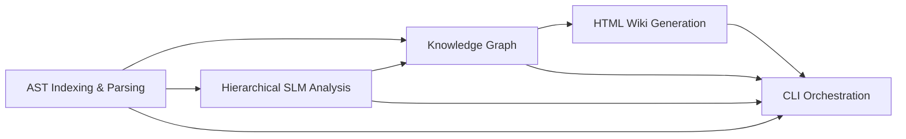

# RepoAtlas — Epics

## Epic 1 — Repository Indexing

### Goal

Analyze a repository from a local path or Git URL and extract its structural information.

### Scope

### Scope

- `scan_structure`
- `save_structure`
- `read_file`
- `parse_java_ast` (Java AST Parser)
- `parse_csharp_ast` (C# AST Parser)
- `build_import_graph` (Symbol Index & Call Graph)

### Acceptance Criteria

- The system successfully scans a local repository or Git repository.
- Java and C# source files are parsed into normalized AST symbol trees.
- An AST-based symbol table and dependency call graph are created.
- Repository structure and symbol index are saved locally for current analysis.

### Dependencies

None.

---

## Epic 2 — Knowledge Graph

### Goal

Build a knowledge graph from repository AST metadata and persist it as `graph.json`.

### Acceptance Criteria

- A `graph.json` file is generated from AST metadata and symbol tables.
- Repository entities and relationships (inheritance, calls, compositions) are represented in the graph.
- Basic relationship queries can be performed using the generated graph.
- Running the analysis again completely regenerates the knowledge graph.

### Dependencies

Epic 1.

---

## Epic 3 — AI Analysis

### Goal

Generate descriptive content for documentation using hierarchical AST chunking and an optional local SLM or remote LLM.

### Scope

- Support local SLM (default) and remote LLM providers.
- Implement 6-tier AST taxonomy chunking (`Repository → Module → Container → Component → Class → Method`).
- Perform bottom-up summarization (Method → Class → Component → Module → Repository).
- Summarize repository technologies, testing infrastructure, architecture layers, and module responsibilities.

### Acceptance Criteria

- Code chunks are constructed strictly along AST node boundaries without line cuts.
- Prompts use compact AST skeletons to adhere to Local SLM context limits (<2k tokens).
- Without an LLM, documentation is generated from AST symbol tables with reduced natural-language summaries.

### Dependencies

Epic 1.

Provides information for Epics 2 and 4.

---

## Epic 4 — Wiki Generation

### Goal

Generate an interactive static HTML documentation website from the knowledge graph and AST summaries.

### Scope

Generate a self-contained static HTML site in `wiki/`:

- `index.html` (Master Dashboard & Bento Grid Overview)
- `tech.html` (Tech Stack & Environment)
- `tests.html` (Test Suites & Run Guides)
- `architecture.html` (System Architecture & Layer Diagrams)
- `modules.html` (3-Column Multi-tier Taxonomy Breakdown: Modules → Containers → Packages → Classes)
- `symbols/*.html` (AST Class/Interface detail pages)
- `search_index.json` (Fast client-side search & Local AI context index)
- Embedded **Local AI Assistant Widget** ("Ask Local AI" floating panel connected to Ollama `qwen2.5-coder:3b` with hybrid client-side index lookup)
- Modern M3 design system with Tailwind CSS, Material Symbols Outlined, and CSS font fallback declarations eliminating FOUT during navigation.

### Acceptance Criteria

- A complete, self-contained HTML website is generated in `wiki/`.
- Sidebar navigation, sticky header, live search bar, dynamic breadcrumbs, and local AI widget operate smoothly (<100ms load time).
- Code blocks contain cross-symbol hyperlinks connecting parameter types to `symbols/<fqn>.html` pages.
- Page font loading remains stable across tab transitions without FOUT or style breaks.

### Dependencies

Epic 2.

Optionally enhanced by Epic 3.

---

## Epic 5 — Command-Line Interface

### Goal

Provide a single CLI command (`repoatlas analyze <path|url>`) that executes the complete repository analysis workflow.

### Scope

- `repoatlas analyze <path|url>` (supports local paths, `https://...` Git URLs, `git@...` SSH, and `owner/repo` shorthands)
- Automatic remote Git cloning and temporary workspace cleanup
- Repository & LLM / SLM configuration
- Structured console progress logging

### Acceptance Criteria

- One command executes the complete workflow (scan, AST parse, chunk, summarize, build knowledge graph, render HTML).
- Interactive static HTML site is generated successfully in `wiki/`.

### Dependencies

Epics 1–4.

---

## Epic Dependency Diagram

## Status

**All Epics (Epic 1 — Epic 5) are Fully Implemented and Verified with 289+ passing unit tests.**
