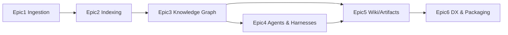

# RepoAtlas — Epics (inferred from the repository)

> These Epics are **inferred** from the declared folder taxonomy and the authored design docs (`docs/vision.md`, `docs/system-overview.md`). The implementation is **Not Determined**; each Epic below is a planning artefact derived from the empty product folders and their names. Epics are presented in dependency order.

## Epic 1 — Repository Ingestion & Management

- **Goal:** Let a Workspace register and manage the repositories that RepoAtlas will analyze.
- **Scope:** Add/list/remove repositories; detect VCS origin; normalize into a managed set (mapped to `repositories/`).
- **Business Value:** Establishes the input surface; without it no downstream intelligence is possible.
- **Functional Areas:** Repo catalog, VCS connector, Workspace scoping.
- **Acceptance Criteria:**
  - A user can add a repository and see it in the managed set.
  - Each repository is identifiable and uniquely versioned.
  - Failed/unauthorized accesses are surfaced clearly.
- **Dependencies:** Core package scaffolding (`packages/`), config layer.
- **Evidence:** `repositories/` folder (empty) is the only trace.

## Epic 2 — Repository Indexing

- **Goal:** Transform a repository into structured metadata (symbols, files, dependencies, tests).
- **Scope:** Language-agnostic parser pipeline, index storage, incremental updates (mapped to `indexes/`).
- **Business Value:** Produces the raw substrate for the knowledge graph; enables search and analysis.
- **Functional Areas:** Parsers, index store, incremental diff, index query.
- **Acceptance Criteria:**
  - A repository can be indexed end-to-end.
  - Index reflects code changes on re-run.
  - Index query returns entities by symbol/path/type.
- **Dependencies:** Epic 1 (repo available), `packages/`.
- **Evidence:** `indexes/` folder (empty); `templates/` and research corpus hint at target ecosystems (Python/Go/TS).

## Epic 3 — Knowledge Graph

- **Goal:** Build and maintain the canonical graph of entities and relationships from indexes.
- **Scope:** Node/edge schema, ingestion from index, query API, provenance/versioning (mapped to `graphs/`).
- **Business Value:** The single source of truth enabling relationship-aware queries and all downstream artifacts.
- **Functional Areas:** Graph store, schema, graph loaders, graph queries.
- **Acceptance Criteria:**
  - Entities and relationships are persisted in a queryable graph.
  - Graph reflects index changes.
  - A relationship query (e.g., "what depends on X") returns correct results.
- **Dependencies:** Epic 2.
- **Evidence:** `graphs/` folder (empty).

## Epic 4 — AI Agents & Harnesses

- **Goal:** Provide orchestrated AI agents that use reusable analysis Harnesses to explore, validate, and refresh the graph.
- **Scope:** Agent runtime, harness framework, cross-validation, refresh loop (mapped to `agents/`; harnesses not yet a folder — see ADR).
- **Business Value:** Delivers the platform's "AI understands" differentiator and keeps knowledge current.
- **Functional Areas:** Agent scheduling, harness registry, model provider abstraction, validation.
- **Acceptance Criteria:**
  - An agent run can select a harness, analyze, and commit validated facts.
  - Facts are traceable to their source.
  - Re-runs refresh deltas rather than full re-analyze.
- **Dependencies:** Epic 3; model gateway.
- **Evidence:** `agents/` folder (empty).

## Epic 5 — Wiki & Artifact Generation

- **Goal:** Render the graph truth into human-consumable artifacts: wiki, diagrams, summaries.
- **Scope:** Wiki renderer, artifact templates, publication/output (mapped to `wiki/`, `output/`, `templates/`).
- **Business Value:** The first user-visible "wow": current, navigable documentation.
- **Functional Areas:** Wiki rendering, template engine, artifact versioning, export.
- **Acceptance Criteria:**
  - Wiki pages are generated from graph data.
  - Output is navigable and linkable.
  - Regeneration yields current content with provenance links.
- **Dependencies:** Epic 3; template assets in `templates/`.
- **Evidence:** `wiki/`, `output/`, `templates/` folders.

## Epic 6 — Developer Experience & Packaging

- **Goal:** Let users install, configure, and operate RepoAtlas (CLI/config/observability).
- **Scope:** CLI, configuration, packaging, logging/metrics (mapped to `packages/`; `output/`).
- **Business Value:** Makes the platform adoptable and operational.
- **Functional Areas:** CLI commands, config, installers, observability.
- **Acceptance Criteria:**
  - A user can install and initialize RepoAtlas.
  - All core flows are reachable via CLI.
  - Logs and metrics are inspectable.
- **Dependencies:** Epics 1–5.
- **Evidence:** no implementation; design surface in `docs/system-overview.md`.

---

## Epic dependency graph

> Status of all Epics: **Planned / Not Implemented**.