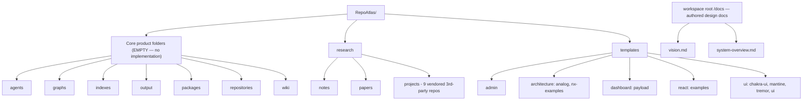

# RepoAtlas — Executive Summary

## Document Status

> **Reference:** This handbook documents the repository **as it currently exists** in the workspace.
> A governing rule of this documentation set: **"Do not hallucinate features."** Where a capability is absent from the repository, it is explicitly marked **Not Determined** rather than invented.

## Project Overview

**RepoAtlas** is the conceptual name for an intended **AI-powered repository intelligence platform** — a system that reads, understands, and turns software repositories into navigable knowledge using AI, knowledge graphs, harnesses, and agents (per `docs/vision.md`).

**However, as of this analysis the `/RepoAtlas/` directory contains no implementation of that platform.** The directory tree is a **greenfield scaffolding** holding:

1. **Empty product-module folders** that define the intended decomposition:
   `agents`, `graphs`, `indexes`, `output`, `packages`, `repositories`, `wiki`.
2. A **research corpus** of vendored third-party open-source projects about repo understanding and wiki generation.
3. A **template library** of vendored web UI/framework scaffolding.

There is **no source code, build system, entry point, configuration, API, database, or test** belonging to RepoAtlas itself anywhere in the tree. All implementation-facing aspects of the architecture are therefore **Not Determined**.

## Business Purpose

The *intended* business purpose, as stated in `docs/vision.md` and encoded by the empty folder names, is to:

- Reduce the time developers need to understand an unfamiliar repository.
- Keep repository documentation current and reliable.
- Preserve architectural knowledge as explicit, queryable assets.

At this stage the business purpose is **aspirational**: the repository provides the *workspace layout*, *reference research*, and *UI template stock* to bootstrap that platform, but delivers no runnable capability yet.

## Evidence for These Conclusions

| Claim | Evidence |
|---|---|
| Product folders are empty | `agents/`, `graphs/`, `indexes/`, `output/`, `packages/`, `repositories/`, `wiki/` each contain **0 files** (verified recursively). |
| `research/` is vendored third-party code | Contains 69 but `research/projects/CodeWiki`, `research/projects/Understand-Anything`, `research/projects/sourcebridge`, `research/projects/llm_wiki`, `research/projects/ExplainThisRepo`, `research/projects/Lingma-SWE-GPT`, `research/projects/RepoUnderstander`, `research/projects/4604aedabac6de04be003694c5ceec5d` — each a complete foreign project (pyproject.toml, go.mod, package.json, .git). |
| Not own source | `research/` holds 15,403 files, `templates/` holds 26,892 files = 100% of the ~42,295 files in the repo; core product folders contribute none. |
| Experiment staged, not committed | `git log` shows one commit `05b89a0 first commit`; `git status` lists the vendored dirs as `A` (staged/uncommitted). |

## Technology Stack — Not Determined for RepoAtlas, Determined for Vendored Assets

Because RepoAtlas has no code, its own technology stack is **Not Determined**. The *vendored* research and template assets are covered by third-party stacks, summarized below for context only:

| Vendored category | Observed stack (from manifest files) |
|---|---|
| `research/projects/CodeWiki` | Python (`pyproject.toml`, `requirements.txt`) — wiki generation |
| `research/projects/ExplainThisRepo` | Python (`pyproject.toml`) + a `.net_version` and `node_version` tree |
| `research/projects/sourcebridge` | Go (`go.mod`, `gqlgen.yml`, gRPC `proto/`) — GraphQL/gRPC repository intelligence |
| `research/projects/llm_wiki` | TypeScript/Vite + Tauri desktop app (`package.json`, `src-tauri`) |
| `research/projects/Understand-Anything` | TypeScript/agent-plugin (`.cursor-plugin`, `.copilot-plugin`, `.claude-plugin`) |
| `research/projects/Lingma-SWE-GPT` | Python (`environment.yml`) |
| `research/projects/RepoUnderstander` | Python/JSONL analysis outputs (`final_report.json`) |
| `templates/**` | React/Next/Vite/Astro/React-Router scaffolding, shadcn-style UI libraries |

## Repository Structure

## Summary

The repository at present is a **read-model/design scaffolding stage** of RepoAtlas: a declared folder taxonomy, a vendored **research reference library**, and a stock of **UI templates**, plus my **authored design documents** (`docs/vision.md`, `docs/system-overview.md`). It is honest to classify this as **Phase 0 — prepare/research**. All functional/runtime/technical details of the actual product are **Not Determined** and will be filled in as code lands into the empty product folders.

## Confidence & Limitations

- **High confidence** — the emptiness of product folders, the presence of only vendored third-party content, and the single staged commit.
- **Inferred, not observed** — the intended meaning of each empty folder name (labeled as such in `vision.md` `design docs`).
- **Not verified** — any runtime behavior, since none exists to observe.