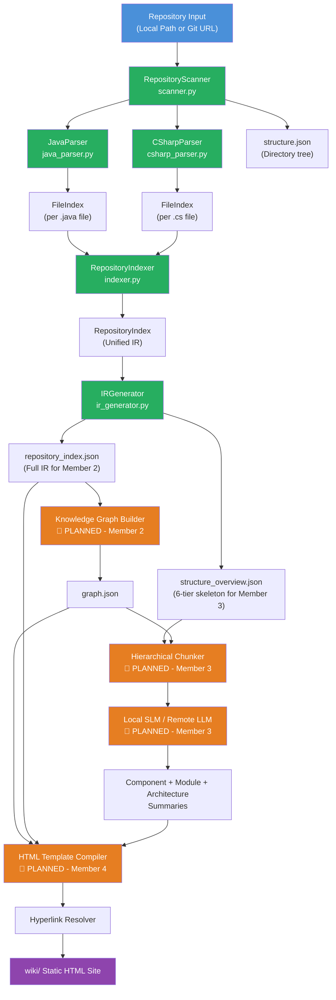
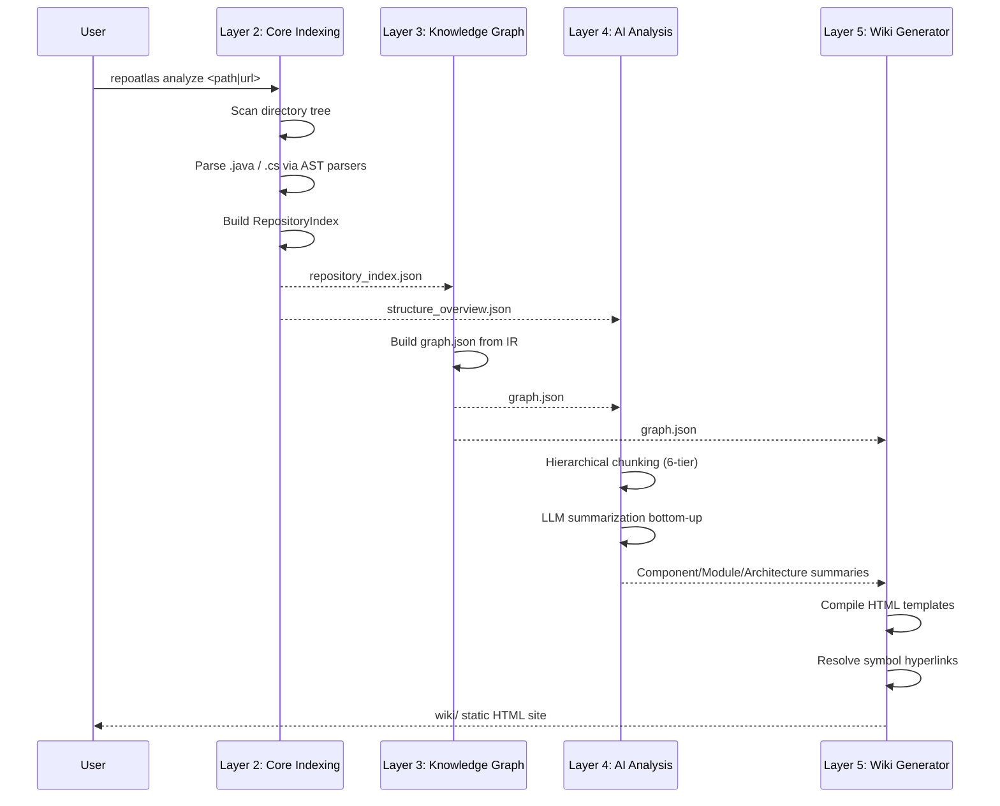

# RepoAtlas — Project Understanding: Architecture

> **Document goal:** Explain how RepoAtlas is structured as a system — its layers, their interactions, inputs, outputs, and the end-to-end flow from repository → Wiki.

---

## 1. System Layers

RepoAtlas is organized into **five sequential processing layers**, each feeding the next:

```
┌─────────────────────────────────────────────────────────────────┐
│  LAYER 1: Repository Input                                      │
│  (local path or Git URL)                                        │
└─────────────────────────────┬───────────────────────────────────┘
                              │
                              ▼
┌─────────────────────────────────────────────────────────────────┐
│  LAYER 2: Core Indexing Engine                                  │
│  (Scanner → AST Parsers → Indexer → IR Generator)              │
│  ✅ IMPLEMENTED                                                 │
└─────────────────────────────┬───────────────────────────────────┘
                              │  repository_index.json
                              │  structure_overview.json
                              │  structure.json
                              ▼
┌─────────────────────────────────────────────────────────────────┐
│  LAYER 3: Knowledge Graph                                       │
│  (Graph Builder → graph.json → Query Engine)                   │
│  ✅ IMPLEMENTED (Member 2)                                      │
└─────────────────────────────┬───────────────────────────────────┘
                              │  graph.json
                              ▼
┌─────────────────────────────────────────────────────────────────┐
│  LAYER 4: AI Analysis                                           │
│  (Hierarchical Chunker → Local SLM / Remote LLM → Summaries)  │
│  ✅ IMPLEMENTED (Member 3)                                      │
└─────────────────────────────┬───────────────────────────────────┘
                              │  Component / Module / Architecture summaries
                              ▼
┌─────────────────────────────────────────────────────────────────┐
│  LAYER 5: Wiki Generation + CLI Orchestration                   │
│  (HTML Template Compiler → Hyperlink Resolver → wiki/)         │
│  ✅ IMPLEMENTED (Member 4)                                      │
└─────────────────────────────────────────────────────────────────┘
```

---

## 2. End-to-End Architecture Diagram



**Legend:**
- 🟢 Green = Implemented (`backend/src/core_indexing/`)
- 🟠 Orange = Planned
- 🟣 Purple = Final output

---

## 3. Layer-by-Layer Description

### Layer 1 — Repository Input

**What it is:** The entry point. The user provides a local directory path or a remote Git URL.

**Observed fact:** The `RepositoryScanner` accepts both forms. For remote URLs matching patterns like `https://github.com/...` or `git@...:.../...git`, it performs a shallow `git clone --depth 1` into a temporary directory.

**Input:** `string` — local path or Git URL  
**Output:** A local directory on disk ready for scanning

---

### Layer 2 — Core Indexing Engine

**What it is:** The implemented core of RepoAtlas. This layer transforms raw source files into a structured, language-agnostic Intermediate Representation (IR).

**Observed fact:** Fully implemented in `backend/src/core_indexing/` with 73 unit tests passing.

#### Sub-components (all implemented):

| Component | File | Responsibility |
|-----------|------|----------------|
| RepositoryScanner | `scanner.py` | Traverse directory tree, apply `.gitignore`, route files to parsers |
| JavaParser | `parsers/java_parser.py` | Parse `.java` files via `tree-sitter-java`, extract AST nodes |
| CSharpParser | `parsers/csharp_parser.py` | Parse `.cs` files via `tree-sitter-c-sharp`, extract AST nodes |
| BaseLanguageParser | `parsers/base.py` | Abstract driver contract for all language parsers |
| RepositoryIndexer | `indexer.py` | Aggregate `FileIndex` objects into unified `RepositoryIndex` |
| IRGenerator | `ir_generator.py` | Serialize `RepositoryIndex` to `repository_index.json` and `structure_overview.json` |
| Unified IR Models | `models.py` | Pydantic schemas: `ASTSymbolNode`, `FileIndex`, `RepositoryIndex`, `RelationshipEdge`, etc. |
| CLI Entry Point | `__main__.py` | `python -m core_indexing <path|url> -o indexes/` |

**Input:** Source files (`.java`, `.cs`)  
**Output:**
- `indexes/structure.json` — Directory tree
- `indexes/repository_index.json` — Full IR with all symbols and relationships
- `indexes/structure_overview.json` — Compact 6-tier skeleton for the Chunker

---

### Layer 3 — Knowledge Graph

**What it is:** Converts the IR (`repository_index.json`) into a persistent, queryable knowledge graph (`graph.json`).

**Status:** 🔲 Not currently implemented — To be implemented by Member 2

**Planned input:** `indexes/repository_index.json`  
**Planned output:** `graphs/graph.json`  
**Planned content of `graph.json`:** Repository entities (classes, modules, namespaces) and typed relationship edges (extends, implements, calls, contains)

**Design reference:** [docs/epics.md](../epics.md) — Epic 2, [docs/user-stories.md](../user-stories.md) — US-2.1, US-2.2, US-2.3

---

### Layer 4 — AI Analysis

**What it is:** Generates natural-language summaries of components, modules, and architecture using a 6-tier hierarchical chunking strategy.

**Status:** 🔲 Not currently implemented — To be implemented by Member 3

**Key design principle:** The LLM does **not** read the full repository source code. Instead:
1. `structure_overview.json` is fed as a compact skeleton
2. The Chunker structures context along AST node boundaries
3. The LLM receives only relevant, syntactically valid code skeletons (<2,000 tokens per prompt)
4. Summarization proceeds **bottom-up**: Method → Class → Component → Module → Repository

**Planned input:** `structure_overview.json` + `graph.json`  
**Planned output:** Component, module, and architecture summaries (fed to Wiki Generator)

**No-LLM fallback:** If no LLM is configured (US-3.2), structural documentation is generated from AST symbol tables alone. Descriptions will be limited but the pipeline still completes.

**Design reference:** [docs/designs/hierarchical-prompting-chunking.md](../designs/hierarchical-prompting-chunking.md)

---

### Layer 5 — Wiki Generation + CLI Orchestration

**What it is:** Renders the knowledge graph and AI summaries into an interactive static HTML documentation site.

**Status:** 🔲 Not currently implemented — To be implemented by Member 4

**Planned input:** `graph.json` + `repository_index.json` + AI summaries  
**Planned output:** `wiki/` — self-contained static HTML site

**Planned wiki structure:**
```
wiki/
├── index.html          # Master dashboard
├── tech.html           # Technology stack
├── tests.html          # Test suites and instructions
├── architecture.html   # System architecture
├── modules/
│   └── <module>.html   # Per-module documentation
└── symbols/
    └── <fqn>.html      # Per-class/interface symbol pages
```

**CLI entry point (planned):** `repoatlas analyze <path|url>`

**Design reference:** [docs/designs/html-wiki-storage.md](../designs/html-wiki-storage.md)

---

## 4. How Layers Communicate



---

## 5. Architecture Style and Design Decisions

| Decision | Choice | Rationale |
|----------|--------|-----------|
| Knowledge graph storage | File (`graph.json`), not a database | Simplicity, portability, local-first (ADR-004) |
| Re-analysis strategy | Full re-run every time | No incremental complexity, predictable output (ADR-005) |
| Language support | Java + C# via tree-sitter | AST precision vs. regex heuristics (ADR-008) |
| LLM integration | Optional, local-first | Privacy, cost, offline usage (ADR-006) |
| Output format | Static HTML, not Markdown | Navigation, search, hyperlinking, portability (ADR-009) |
| Chunking strategy | 6-tier AST taxonomy | Fit local SLMs (<2k tokens per prompt), reduce hallucinations (ADR-010) |

---

## 6. Fact vs. Inference vs. Planned

| Claim | Status |
|-------|--------|
| Core Indexing Engine exists and is tested | ✅ **Observed Fact** |
| Scanner accepts local paths and Git URLs | ✅ **Observed Fact** (`scanner.py`) |
| Java parser uses `tree-sitter-java` | ✅ **Observed Fact** (`java_parser.py` imports) |
| C# parser uses `tree-sitter-c-sharp` | ✅ **Observed Fact** (`csharp_parser.py` imports) |
| Knowledge Graph outputs `graph.json` | 🔲 **Planned** (Epic 2, not implemented) |
| LLM summarization uses bottom-up chunking | 🔲 **Planned** (Epic 3, design in `hierarchical-prompting-chunking.md`) |
| Wiki is a static HTML site | 🔲 **Planned** (Epic 4, design in `html-wiki-storage.md`) |
| `repoatlas analyze <path>` CLI command | 🔲 **Planned** (Epic 5, partial in `__main__.py` for core indexing only) |
| System follows a layered architecture | 💡 **Inferred** from design documents and code structure |

---

## 7. Current State of the Architecture

> **Executive summary:** As of the current repository state, **Layer 2 (Core Indexing Engine) is fully implemented**. Layers 3–5 are defined in design documents but have no implementation yet.

```
Layer 1: Input          ✅ (handled by scanner.py)
Layer 2: Core Indexing  ✅ (fully implemented + tested)
Layer 3: Knowledge Graph  🔲 (planned, designed)
Layer 4: AI Analysis    🔲 (planned, designed in docs/designs/)
Layer 5: Wiki + CLI     🔲 (planned, designed in docs/designs/)
```

The `backend/src/ai_analysis/` and `backend/src/knowledge_graph/` directories exist but contain **no implementation code** — only `__pycache__` directories.

---

## 8. Related Documentation

| Document | Relationship |
|----------|-------------|
| [docs/architecture.md](../architecture.md) | System-level architecture (top-level view) |
| [docs/system-overview.md](../system-overview.md) | Processing pipeline and tool inventory |
| [docs/designs/ast-parser-design.md](../designs/ast-parser-design.md) | Layer 2 deep-dive |
| [docs/designs/hierarchical-prompting-chunking.md](../designs/hierarchical-prompting-chunking.md) | Layer 4 deep-dive |
| [docs/designs/html-wiki-storage.md](../designs/html-wiki-storage.md) | Layer 5 deep-dive |
| [modules.md](./modules.md) | Module-level view of these layers |
| [components.md](./components.md) | Component-level detail |
| [data-flow.md](./data-flow.md) | Data artifacts flowing between layers |
