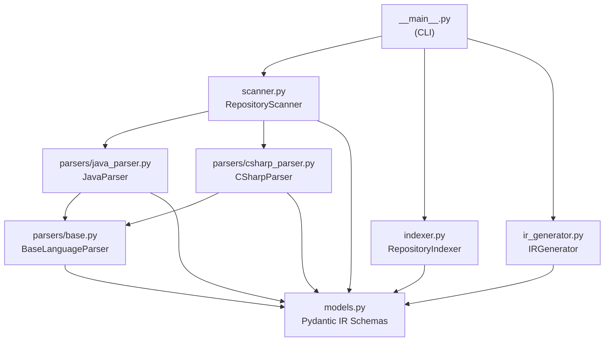

# RepoAtlas — Project Understanding: Backend Understanding

> **Document goal:** Explain how the RepoAtlas backend is structured — its Python packages, layers, execution flow, and how it understands the repository being analyzed.

---

## 1. Backend Overview

The RepoAtlas backend is a **Python application** that implements the repository analysis pipeline. It is located at `backend/` and currently contains the fully implemented Core Indexing Engine.

```
backend/
├── pyproject.toml          # Build & dependency configuration
├── requirements.txt        # Runtime dependencies
├── README.md               # Backend quickstart
├── src/
│   ├── core_indexing/      # ✅ IMPLEMENTED — Member 1
│   │   ├── __init__.py
│   │   ├── __main__.py     # CLI entry point
│   │   ├── models.py       # Unified IR schema (Pydantic)
│   │   ├── scanner.py      # Repository Scanner
│   │   ├── indexer.py      # Cross-file symbol indexer
│   │   ├── ir_generator.py # IR JSON exporter
│   │   └── parsers/
│   │       ├── base.py     # Abstract parser contract
│   │       ├── java_parser.py
│   │       └── csharp_parser.py
│   ├── knowledge_graph/    # 🔲 PLANNED — Member 2
│   └── ai_analysis/        # 🔲 PLANNED — Member 3
│       ├── llm/
│       ├── taxonomy/
│       └── tools/
└── tests/
    ├── conftest.py
    ├── fixtures/           # Sample Java & C# source files
    ├── test_scanner.py
    ├── test_java_parser.py
    ├── test_csharp_parser.py
    └── test_ir_generator.py
```

---

## 2. Backend Architecture Style

RepoAtlas does **not** follow a traditional MVC or service/controller pattern. Instead it follows a **pipeline architecture** — a linear sequence of transformation stages where each stage consumes the output of the previous one.

```
Input Stage
    ↓
Parsing Stage
    ↓
Indexing Stage
    ↓
Export Stage
    ↓ (planned)
Graph Stage
    ↓ (planned)
Analysis Stage
    ↓ (planned)
Rendering Stage
```

There is no:
- Controller / Route layer
- Service / Repository layer (in the MVC sense)
- Database
- ORM

> **Observed fact:** The backend is a stateless CLI application. No persistent state is maintained between runs. All output is written to files (`indexes/`, `graphs/`, `wiki/`).

---

## 3. Implemented Backend: Core Indexing Engine

### 3.1 Execution Flow

When the user runs:

```bash
python -m core_indexing <path|url> -o indexes/
```

The execution flow is:

```python
# __main__.py
scanner = RepositoryScanner(target=args.target, output_dir=args.output_dir)

# Step 1: Scan
tree, file_indexes = scanner.scan_and_parse()
# ↳ prepare_repository() — clone or validate
# ↳ scan_structure()     — build DirectoryNode tree
# ↳ save_structure()     — write structure.json
# ↳ scan_and_parse()     — walk files, dispatch to parsers

# Step 2: Index
indexer = RepositoryIndexer(
    repository_name=..., repository_path=...,
    directory_tree=tree, file_indexes=file_indexes,
)
index = indexer.build_index()
# ↳ _register_symbols()               — build FQN registry
# ↳ _extract_structural_relationships() — extends, implements, contains, uses_field
# ↳ _deduplicate_relationships()       — remove duplicate edges

# Step 3: Export
generator = IRGenerator(index=index, output_dir=args.output_dir)
repo_path, overview_path = generator.generate_all()
# ↳ generate_repository_index()  → repository_index.json
# ↳ generate_structure_overview() → structure_overview.json
```

### 3.2 Dependency Diagram (Implemented)



### 3.3 Layer Separation

While not MVC, there are clear layer boundaries:

| Layer | Files | Responsibility |
|-------|-------|----------------|
| **Schema / Model** | `models.py` | Data contracts — all Pydantic models |
| **Parsing** | `parsers/*.py` | Source → AST nodes |
| **Aggregation** | `indexer.py` | Many files → one unified index |
| **Export** | `ir_generator.py` | In-memory index → JSON files |
| **Orchestration** | `scanner.py` | Coordinate parsing; `__main__.py` — CLI |

---

## 4. How the Backend "Understands" a Repository

The backend's understanding proceeds through three phases:

### Phase 1: Structural Understanding

**What:** What files exist and how are they organized?

```
Repository root
    ↓ DirectoryNode tree
    → Files by type and path
    → Ignored patterns (.gitignore)
    → Language detection by extension (.java / .cs)
```

**Output:** `structure.json` — a navigable tree of the repository's directory and file layout.

### Phase 2: Syntactic Understanding (AST)

**What:** What code constructs exist in each file?

```
Each .java / .cs file
    ↓ tree-sitter parse
    → Package/namespace
    → Classes, interfaces, enums, records
    → Methods with signatures, return types, parameters
    → Fields and properties with types
    → Annotations and attributes (@Service, [ApiController])
    → Javadoc / XML doc comments
    → Imports and using directives
```

**Output:** `ASTSymbolNode` list per file → aggregated into `RepositoryIndex.symbols`

### Phase 3: Relational Understanding

**What:** How do code constructs relate to each other?

```
Across all files
    ↓ RepositoryIndexer
    → extends relationships (class inheritance)
    → implements relationships (interface contracts)
    → uses_field relationships (field type dependencies)
    → contains relationships (class → method, class → field)
```

**Output:** `RepositoryIndex.relationships` → serialized in `repository_index.json`

### What the Backend Does NOT Yet Understand

| Understanding | Status |
|--------------|--------|
| Module-level grouping (business domains) | 🔲 Planned (requires heuristics or LLM) |
| Architecture layers (MVC, service-repo pattern, etc.) | 🔲 Planned (requires LLM inference) |
| Natural-language summaries of classes/methods | 🔲 Planned (requires LLM) |
| Runtime behavior, test coverage, performance | Out of scope |

---

## 5. Backend Testing

### Test Suite

**Location:** `backend/tests/`  
**Framework:** `pytest`  
**Test count:** 73 tests (all passing)

| Test file | Covers |
|-----------|--------|
| `test_scanner.py` | RepositoryScanner — local paths, Git detection, structure building |
| `test_java_parser.py` | JavaParser — classes, interfaces, enums, annotations, methods, fields |
| `test_csharp_parser.py` | CSharpParser — classes, records, attributes, properties, async methods |
| `test_ir_generator.py` | IRGenerator — repository_index.json and structure_overview.json output |

### Fixtures

**Location:** `backend/tests/fixtures/`

Contains sample Java and C# source files used as test inputs to validate parsing accuracy.

### Running Tests

```bash
cd backend
python -m pytest tests/ -v
```

---

## 6. Backend Dependencies

| Dependency | Version (from requirements.txt) | Purpose |
|------------|--------------------------------|---------|
| `tree-sitter` | — | AST parsing engine |
| `tree-sitter-java` | — | Java grammar for tree-sitter |
| `tree-sitter-c-sharp` | — | C# grammar for tree-sitter |
| `pydantic` | — | Schema validation, JSON serialization |
| `pathspec` | — | `.gitignore` pattern matching |

> **Observed fact:** `requirements.txt` exists at `backend/requirements.txt` with 101 bytes. Exact version pins are defined there.

---

## 7. Planned Backend Extensions

### Member 2: Knowledge Graph (`backend/src/knowledge_graph/`)

**Implemented:** Load `repository_index.json`, build `graph.json` with nodes and typed edges. Provide query API over the graph.

### Member 3: AI Analysis (`backend/src/ai_analysis/`)

**Implemented:**
- `llm/` — LLM client supporting Ollama (local SLM: `qwen2.5-coder:3b` default) and `NullLLMClient` fallback
- `taxonomy/` — 6-tier hierarchical chunker
- `tools/` — `summarize()` tool + analysis utilities

### Member 4: Wiki Generator + CLI

**Implemented:** HTML template compiler, hyperlink resolver, static site writer (`wiki/index.html`, `tech.html`, `architecture.html`, `modules.html`, `tests.html`, `symbols/*.html`), and full `repoatlas analyze` CLI orchestration.

---

## 8. Fact vs. Inference vs. Planned

| Claim | Status |
|-------|--------|
| Backend is a Python pipeline application | ✅ **Observed Fact** |
| Backend test suite passes (289+ tests) | ✅ **Observed Fact** (`pytest tests/`) |
| `tree-sitter-java` and `tree-sitter-c-sharp` are the AST engines | ✅ **Observed Fact** (imports in parsers) |
| Knowledge Graph builder and Query API implemented | ✅ **Observed Fact** (`knowledge_graph/`) |
| AI Analysis Engine with 6-tier taxonomy implemented | ✅ **Observed Fact** (`ai_analysis/`) |
| Default local SLM model is `qwen2.5-coder:3b` via Ollama | ✅ **Observed Fact** (`DEFAULT_MODEL` in `ollama.py`) |
| CLI `repoatlas analyze` end-to-end orchestration implemented | ✅ **Observed Fact** (`src/cli.py`) |

