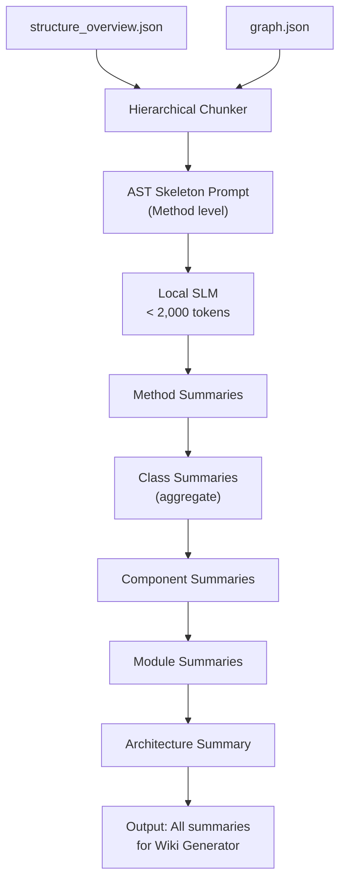
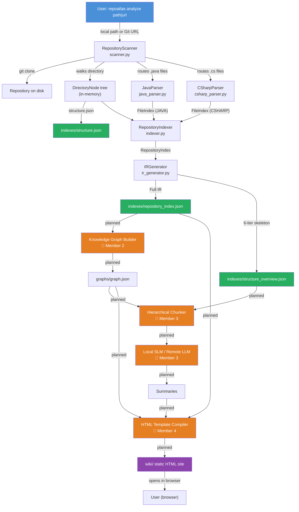

# RepoAtlas — Project Understanding: Data Flow

> **Document goal:** Explain exactly what data is produced at each step of the RepoAtlas pipeline, in what format, and which component produces/consumes it.

---

## 1. Pipeline Overview

```
Step 1: Repository Input
        ↓
Step 2: Directory Scan + Structure Persistence
        ↓  structure.json
Step 3: Source File Parsing (AST)
        ↓  FileIndex per file
Step 4: Repository Indexing + Relationship Extraction
        ↓  RepositoryIndex (in-memory)
Step 5: IR Export
        ↓  repository_index.json + structure_overview.json
Step 6: Knowledge Graph Construction (Planned)
        ↓  graph.json
Step 7: Hierarchical Chunking + LLM Summarization (Planned)
        ↓  Component / Module / Architecture summaries
Step 8: Wiki HTML Generation (Planned)
        ↓  wiki/ static HTML site
```

**Implementation status:**
- Steps 1–5: ✅ Implemented
- Steps 6–8: 🔲 Planned

---

## 2. Step 1 — Repository Input

### Producer
`User` (via CLI)

### Consumer
`RepositoryScanner.__init__()` and `RepositoryScanner.prepare_repository()`

### Data

| Artifact | Format | Description |
|----------|--------|-------------|
| `target` string | String | Local path (`/path/to/repo`) or Git URL (`https://github.com/org/repo.git`) |

### How `RepositoryScanner` handles it

```python
# Local path:
repo_path = Path(target).resolve()  # validates existence

# Git URL (detected by pattern matching):
git clone --depth 1 <target> <temp_dir>
repo_path = Path(temp_dir).resolve()
```

**Git URL patterns detected:**
- `https?://.*\.git$`
- `git@.*:.*\.git$`
- `https?://github\.com/.*`
- `https?://gitlab\.com/.*`
- `https?://bitbucket\.org/.*`

---

## 3. Step 2 — Directory Scan + Structure Persistence

### Producer
`RepositoryScanner.scan_structure()` + `RepositoryScanner.save_structure()`

### Consumer
- `RepositoryIndexer` (receives the `DirectoryNode` object)
- `IRGenerator` (indirectly, via `RepositoryIndex.directory_tree`)

### Data Produced

#### In-memory: `DirectoryNode` tree

```json
{
  "name": "MyRepo",
  "path": ".",
  "is_directory": true,
  "children": [
    {
      "name": "src",
      "path": "src",
      "is_directory": true,
      "children": [
        {
          "name": "UserService.java",
          "path": "src/UserService.java",
          "is_directory": false,
          "language": "java"
        }
      ]
    }
  ]
}
```

#### On disk: `indexes/structure.json`

Same structure serialized as JSON (via `DirectoryNode.model_dump(exclude_none=True)`).

### Filtering applied

- Directories excluded by name: `.git`, `node_modules`, `bin`, `obj`, `target`, `build`, `.gradle`, `__pycache__`, etc.
- Entries excluded by `.gitignore` rules (loaded via `pathspec`)

---

## 4. Step 3 — Source File Parsing (AST)

### Producer
`JavaParser.parse()` or `CSharpParser.parse()` (called by `RepositoryScanner.scan_and_parse()`)

### Consumer
`RepositoryIndexer`

### Data Produced: `FileIndex`

One `FileIndex` is produced per source file.

#### `FileIndex` schema

```json
{
  "file_path": "src/main/java/com/example/auth/UserService.java",
  "language": "java",
  "package_or_namespace": "com.example.auth",
  "imports": [
    {
      "name": "org.springframework.stereotype.Service",
      "is_wildcard": false,
      "is_static": false
    }
  ],
  "symbols": [
    {
      "symbol_id": "com.example.auth.UserService",
      "language": "java",
      "kind": "CLASS",
      "name": "UserService",
      "fully_qualified_name": "com.example.auth.UserService",
      "file_path": "src/main/java/com/example/auth/UserService.java",
      "range": {"start_line": 10, "end_line": 85},
      "modifiers": ["public"],
      "annotations": [{"name": "Service", "arguments": {}}],
      "docstring": "Service layer for user authentication.",
      "parent_symbol_id": null,
      "extends": null,
      "implements": ["com.example.auth.IUserService"]
    },
    {
      "symbol_id": "com.example.auth.UserService.authenticate(String,String)",
      "language": "java",
      "kind": "METHOD",
      "name": "authenticate",
      "fully_qualified_name": "com.example.auth.UserService.authenticate",
      "file_path": "src/main/java/com/example/auth/UserService.java",
      "range": {"start_line": 45, "end_line": 68},
      "modifiers": ["public"],
      "annotations": [{"name": "Transactional", "arguments": {"readOnly": "false"}}],
      "docstring": "Authenticates user credentials and returns a JWT token.",
      "parent_symbol_id": "com.example.auth.UserService",
      "signature": {
        "return_type": "String",
        "parameters": [
          {"name": "username", "type": "String", "modifiers": []},
          {"name": "password", "type": "String", "modifiers": []}
        ],
        "thrown_exceptions": ["AuthenticationException"],
        "is_async": false
      },
      "dependencies": ["com.example.auth.UserRepository"]
    }
  ]
}
```

### AST Parsing Process (Observed)

```
Source file text (UTF-8)
    ↓
tree-sitter parser creates a concrete syntax tree
    ↓
Parser walks the syntax tree:
    For Java:
        - package_declaration node → package FQN
        - import_declaration nodes → ImportInfo list
        - class_declaration / interface_declaration / enum_declaration nodes:
            - modifiers → List[str]
            - marker_annotation / normal_annotation nodes → AnnotationInfo list
            - field_declaration nodes → ASTSymbolNode (kind=FIELD)
            - method_declaration nodes → ASTSymbolNode (kind=METHOD)
              ↳ formal_parameters → ParameterInfo list
              ↳ block_comment (Javadoc) → docstring
            - superclass / super_interfaces → extends/implements strings
    ↓
FileIndex (language, file_path, package, imports, symbols)
```

---

## 5. Step 4 — Repository Indexing + Relationship Extraction

### Producer
`RepositoryIndexer.build_index()`

### Consumer
`IRGenerator`

### Data Produced: `RepositoryIndex`

Aggregates all `FileIndex` objects into a unified IR.

#### `RepositoryIndex` schema (top-level structure)

```json
{
  "repository_name": "MyRepo",
  "repository_path": "/absolute/path/to/MyRepo",
  "languages": ["java", "csharp"],
  "directory_tree": { ... },
  "files": [ ... list of FileIndex ... ],
  "symbols": [ ... flat list of all ASTSymbolNode across all files ... ],
  "relationships": [
    {
      "source": "com.example.auth.UserService",
      "target": "com.example.auth.IUserService",
      "kind": "implements",
      "line": 10
    },
    {
      "source": "com.example.auth.UserService",
      "target": "com.example.auth.UserService.authenticate",
      "kind": "contains",
      "line": 45
    }
  ]
}
```

### Relationship Types Extracted

| Kind | Description | Source |
|------|-------------|--------|
| `extends` | Class inherits from another class | `ASTSymbolNode.extends` |
| `implements` | Class implements an interface | `ASTSymbolNode.implements` |
| `uses_field` | Field/property is of a known project type | `ASTSymbolNode.field_type` |
| `contains` | Parent symbol contains child symbol | `ASTSymbolNode.parent_symbol_id` |

> **Note:** `calls` relationships (method invocations) are mentioned in design documents but their extraction status in the current `indexer.py` is **not explicitly implemented** at the indexer level. Java/C# parsers may capture `dependencies` on `ASTSymbolNode`, but the `RepositoryIndexer` only extracts the four types listed above.

---

## 6. Step 5 — IR Export

### Producer
`IRGenerator.generate_all()`

### Consumer
- **Member 2** — Knowledge Graph Builder (`repository_index.json`)
- **Member 3** — Hierarchical Chunker (`structure_overview.json`)
- **Member 4** — Wiki Generator (`repository_index.json`)

### Data Produced

#### `indexes/repository_index.json`

Full serialization of `RepositoryIndex` (JSON, human-readable, ~indented). Contains all symbols, relationships, file indexes, and directory tree.

#### `indexes/structure_overview.json`

Compact 6-tier skeleton map for the Chunker. **Does not contain raw source bodies.**

```json
{
  "repository": "MyRepo",
  "languages": ["java"],
  "total_symbols": 47,
  "modules": [
    {
      "name": "MyRepo",
      "containers": [
        {
          "name": "MainContainer",
          "components": [
            {
              "name": "com.example.auth",
              "classes": [
                {
                  "fqn": "com.example.auth.UserService",
                  "kind": "CLASS",
                  "methods": ["authenticate", "register", "logout"]
                },
                {
                  "fqn": "com.example.auth.IUserService",
                  "kind": "INTERFACE",
                  "methods": ["authenticate", "register"]
                }
              ]
            }
          ]
        }
      ]
    }
  ]
}
```

> **Limitation noted:** Current `IRGenerator._build_skeleton_modules()` groups all components under a single `"MainContainer"`. This is a simplification. Multi-module repositories will benefit from a more nuanced module-detection heuristic in future iterations.

---

## 7. Step 6 — Knowledge Graph Construction (Planned)

**Status:** 🔲 Not currently implemented

### Producer (Planned)
Knowledge Graph Builder (Member 2)

### Consumer (Planned)
- AI Analysis (Member 3)
- Wiki Generator (Member 4)

### Input
`indexes/repository_index.json`

### Output (Planned)
`graphs/graph.json`

```json
{
  "nodes": [
    {
      "id": "com.example.auth.UserService",
      "kind": "CLASS",
      "language": "java",
      "file_path": "src/.../UserService.java",
      "annotations": ["Service"],
      "summary": null
    }
  ],
  "edges": [
    {
      "source": "com.example.auth.UserService",
      "target": "com.example.auth.IUserService",
      "kind": "implements"
    }
  ],
  "metadata": {
    "repository": "MyRepo",
    "generated_at": "2026-08-12T09:00:00Z"
  }
}
```

> **Note:** The exact `graph.json` schema is not yet defined in source code. The above is inferred from the IR's `RelationshipEdge` model and Epic 2 design intent.

---

## 8. Step 7 — Hierarchical Chunking + LLM Summarization (Planned)

**Status:** 🔲 Not currently implemented

### Producer (Planned)
Hierarchical Chunker + LLM Client + Bottom-Up Summarizer (Member 3)

### Consumer (Planned)
Wiki Generator (Member 4)

### Input (Planned)
- `indexes/structure_overview.json`
- `graphs/graph.json`

### Process (Planned)



### Data Format of Prompts (Planned, from design)

```
SYSTEM: You are an expert software architect analyzing a Java/C# codebase.
TARGET CONTEXT (Level 4: Component)
Module: OrderManagement | Container: Order.API | Component: Controllers
STRUCTURAL SKELETON:
  + Component: Controllers
    - Class: OrderController
      * CreateOrder(OrderDto dto) [Javadoc: Handles checkout POST request]
      * CancelOrder(Guid orderId) [Javadoc: Cancels active order]
TASK: Summarize the responsibility of the Controllers component in <100 words.
Output format: Clean Markdown bullet points.
```

### No-LLM Fallback (Planned, US-3.2)

If no LLM is configured, the system generates structural descriptions directly from AST symbol tables:
- Class names, method signatures, field types
- Annotation-based role hints (e.g., `@RestController` → "REST API controller")
- Import-based dependency hints
- No natural-language descriptions — structured data only

---

## 9. Step 8 — Wiki HTML Generation (Planned)

**Status:** 🔲 Not currently implemented

### Producer (Planned)
HTML Template Compiler → Hyperlink Resolver → Static Site Writer (Member 4)

### Input (Planned)
- `graphs/graph.json`
- `indexes/repository_index.json`
- Summaries from Step 7

### Output (Planned)

```
wiki/
├── index.html          # Master dashboard
├── tech.html           # Technology stack, dependencies, build info
├── tests.html          # Test suites, coverage, run instructions
├── architecture.html   # Architecture diagram + layer descriptions
├── assets/
│   ├── css/
│   │   ├── main.css
│   │   └── prism.min.css
│   └── js/
│       ├── main.js
│       ├── prism.min.js
│       └── mermaid.min.js
├── modules/
│   ├── auth-service.html
│   └── order-service.html
└── symbols/
    ├── com.example.auth.UserService.html
    └── com.example.auth.UserRepository.html
```

### Hyperlink Resolution (Planned)

```
Input summary text:
"The UserService class depends on UserRepository for data access."
        ↓
Hyperlink Resolver scans for known FQNs
        ↓
Output HTML:
"The <a href="../symbols/com.example.auth.UserService.html">UserService</a>
class depends on <a href="../symbols/com.example.auth.UserRepository.html">
UserRepository</a> for data access."
```

---

## 10. Complete Data Flow Diagram



---

## 11. Data Artifact Reference Table

| Artifact | Format | Location | Producer | Consumer | Status |
|----------|--------|----------|----------|----------|--------|
| Repository source files | `.java`, `.cs` | Analyzed repo | — | JavaParser, CSharpParser | Input |
| `DirectoryNode` tree | Python object | In-memory | RepositoryScanner | RepositoryIndexer, IRGenerator | ✅ |
| `FileIndex` (per file) | Python object | In-memory | JavaParser / CSharpParser | RepositoryIndexer | ✅ |
| `RepositoryIndex` | Python object | In-memory | RepositoryIndexer | IRGenerator | ✅ |
| `structure.json` | JSON | `indexes/` | RepositoryScanner | (Reference) | ✅ |
| `repository_index.json` | JSON | `indexes/` | IRGenerator | KG Builder, Wiki Generator | ✅ |
| `structure_overview.json` | JSON | `indexes/` | IRGenerator | Hierarchical Chunker | ✅ |
| `graph.json` | JSON | `graphs/` | KG Builder | AI Summarizer, Wiki Generator | 🔲 |
| LLM prompt batches | Text (structured) | In-memory | Hierarchical Chunker | Local SLM / Remote LLM | 🔲 |
| Summaries | Markdown/Text | In-memory | LLM | Wiki Generator | 🔲 |
| `wiki/*.html` | HTML | `wiki/` | Wiki Generator | End user (browser) | 🔲 |

---

## 12. Fact vs. Inference vs. Planned

| Claim | Status |
|-------|--------|
| `structure.json` contains a `DirectoryNode` tree | ✅ **Observed Fact** |
| `repository_index.json` contains all symbols and 4 relationship types | ✅ **Observed Fact** |
| `structure_overview.json` groups classes into a single "MainContainer" | ✅ **Observed Fact** (IRGenerator source) |
| `calls` relationships are extracted from method bodies | ⚠️ **Partial** — `ASTSymbolNode.dependencies` exists in schema; extraction coverage varies by parser implementation |
| `graph.json` schema | 🔲 **Planned** — not yet defined in code |
| LLM prompts follow the template format shown | 💡 **Inferred** from `hierarchical-prompting-chunking.md` |
| Wiki pages include sidebar tree navigation | 💡 **Inferred** from `html-wiki-storage.md` |
| Structure overview module-grouping is simplified | ✅ **Observed Fact** (IRGenerator uses "MainContainer" hardcoded) |
