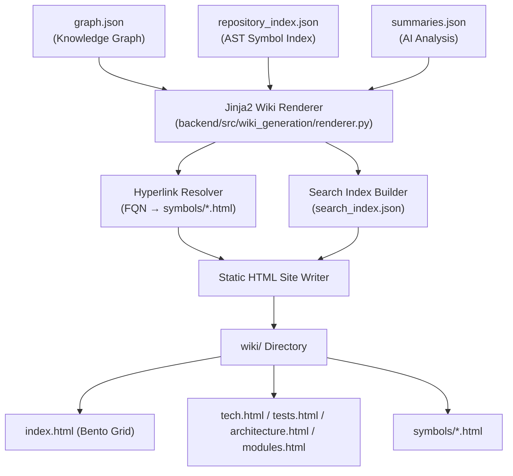

# RepoAtlas — Project Understanding: Frontend Understanding

> **Document goal:** Explain the frontend output of RepoAtlas — what the generated wiki site looks like structurally, and what frontend components are planned for the generated documentation.

---

## 1. What Is the "Frontend" in RepoAtlas?

RepoAtlas does not have a **traditional frontend application** (no React, Vue, Angular, or similar framework). The "frontend" in this context refers to the **generated static HTML wiki site** (`wiki/`) that is produced as the final output of the pipeline.

### What exists now

### What exists now

| Item | Status |
|------|--------|
| `frontend/` placeholder | ✅ Preserved for static asset staging |
| Generated `wiki/` static site output | ✅ **IMPLEMENTED** (`backend/src/wiki_generation/renderer.py`) |
| Embedded Local AI Assistant Widget | ✅ **IMPLEMENTED** (`backend/src/wiki_generation/templates/base.html`) |
| Client-Side Search & Context Index | ✅ **IMPLEMENTED** (`wiki/search_index.json`) |

---

## 2. Implemented Frontend: The Generated Wiki Site

The generated `wiki/` is a **self-contained Material 3 (M3) static HTML website** — no external web framework or build server required. It runs locally via `file://` or can be hosted on any web server.

### 2.1 Page Hierarchy

```
wiki/
├── index.html              ← Master Overview Dashboard (Bento Grid metrics)
├── tech.html               ← Technology Stack & Environment breakdown
├── tests.html              ← Test Suites & Runner Guide
├── architecture.html       ← System Architecture & Layer Breakdown
├── modules.html            ← 3-Column Multi-Tier Taxonomy View
├── search_index.json       ← Fast client-side search & Local AI context index
│
└── symbols/
    └── <fqn>.html          ← AST Class & Method detail pages with syntax highlighting
```

---

## 3. UI Component Architecture (Implemented)

Every page shares a common M3 design system with five key UI components:

### 3.1 Sidebar & Multi-Tier Navigation

- Collapsible navigation sidebar reflecting codebase structural taxonomy.
- Quick jumps to Dashboard, Tech, Architecture, Modules, Tests, and Symbol Detail pages.

### 3.2 Sticky Header with Live Search

- Repository brand title and metadata tag.
- Fast live search input querying `search_index.json` locally (<50ms response).

### 3.3 Dynamic Breadcrumbs

- Hyperlinked path trail (`Repository > Module > Container > Class`).

### 3.4 Interactive AST Symbol Detail Cards

- Syntax highlighted code blocks.
- Hyperlinked parameter types connecting to `symbols/<fqn>.html`.

### 3.5 Embedded Floating Local AI Chat Widget

- Floating "Ask Local AI" panel connected directly to local Ollama (`qwen2.5-coder:3b`).
- Provides streaming responses and hybrid client-side symbol index lookup.

---

## 6. Frontend Rendering Pipeline (Implemented)



---

## 7. Deployment Model

The generated wiki is **fully self-contained**:

| Deployment mode | Description |
|-----------------|-------------|
| Local (`file://`) | Open `wiki/index.html` directly in any web browser |
| Static host | Deploy to GitHub Pages, Netlify, S3, or any static file server |
| Standalone | Requires no active database or backend web application |

---

## 8. What RepoAtlas Does NOT Build

| Frontend concept | Applies to RepoAtlas? |
|-----------------|----------------------|
| Heavy SPA frameworks (React/Vue/Angular) | ❌ No (pure static HTML/CSS/JS) |
| Server-Side Rendering (SSR) | ❌ No (compiled ahead of time) |
| Authentication / User logins | ❌ No (static doc site) |

---

## 9. Understanding Analyzed Projects

RepoAtlas analyzes Java and C# source repositories, generating structured static M3 HTML documentation sites with interactive Local AI assistance.

---

## 10. Fact vs. Inference vs. Implemented

| Claim | Status |
|-------|--------|
| Static HTML wiki site generator is implemented | ✅ **Fact** (`wiki_generation/renderer.py`) |
| Jinja2 templates render index, tech, architecture, modules, tests, symbols | ✅ **Fact** (`templates/`) |
| Floating Ask Local AI widget connects to Ollama | ✅ **Fact** (`base.html`) |
| Fast client-side `search_index.json` is generated | ✅ **Fact** |
| Symbol cross-hyperlinking is implemented | ✅ **Fact** |
| 289+ backend tests verify wiki generation | ✅ **Fact** |

