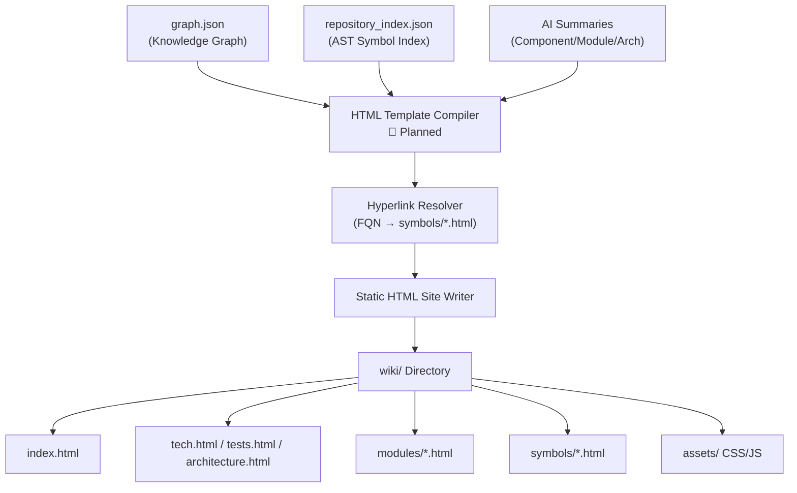

# RepoAtlas — Project Understanding: Frontend Understanding

> **Document goal:** Explain the frontend output of RepoAtlas — what the generated wiki site looks like structurally, and what frontend components are planned for the generated documentation.

---

## 1. What Is the "Frontend" in RepoAtlas?

RepoAtlas does not have a **traditional frontend application** (no React, Vue, Angular, or similar framework). The "frontend" in this context refers to the **generated static HTML wiki site** (`wiki/`) that is produced as the final output of the pipeline.

### What exists now

| Item | Status |
|------|--------|
| `frontend/` directory | ✅ Exists — contains only `.gitkeep` |
| Web app code (React, Vue, etc.) | ❌ Does not exist |
| Generated `wiki/` output | 🔲 Planned — not yet generated |

> **Observed fact:** `frontend/` contains only a `.gitkeep` placeholder file. No frontend application code has been implemented.

---

## 2. Planned Frontend: The Generated Wiki Site

The generated `wiki/` is a **self-contained static HTML website** — no JavaScript framework, no server required. It runs locally via `file://` or can be deployed to any static host.

### 2.1 Page Hierarchy

```
wiki/
├── index.html              ← Master Dashboard
│
├── tech.html               ← Technology Stack & Build Info
├── tests.html              ← Test Suites & Run Instructions
├── architecture.html       ← System Architecture & Diagrams
│
├── modules/
│   ├── <module-a>.html     ← Module A documentation
│   └── <module-b>.html     ← Module B documentation
│
└── symbols/
    ├── <fqn-1>.html        ← Class/Interface detail page
    └── <fqn-2>.html        ← Class/Interface detail page
```

**Relationship diagram:**

```
index.html (Master Dashboard)
    ├── tech.html
    ├── tests.html
    ├── architecture.html
    └── modules/
            └── <module>.html
                    └── symbols/<fqn>.html
```

### 2.2 Pages and Their Content (Planned)

| Page | File | Content |
|------|------|---------|
| Master Dashboard | `index.html` | Project overview, quick navigation, executive summary |
| Tech | `tech.html` | Programming languages, frameworks, dependencies, build tools, runtime environment |
| Tests | `tests.html` | Test suites, test frameworks, coverage summary, run instructions |
| Architecture | `architecture.html` | High-level architecture, layer diagram (Mermaid), layer descriptions |
| Module | `modules/<name>.html` | Module purpose, component list, class summary, dependency diagram |
| Symbol | `symbols/<fqn>.html` | Full AST symbol page: class/interface name, hierarchy, fields, methods, Javadoc, cross-links |

---

## 3. UI Component Architecture (Planned)

Every page shares a common layout with five key UI components:

### 3.1 Sidebar Module/File Tree

- Collapsible tree navigation reflecting the codebase hierarchy
- Mirrors the `Repository → Module → Component → Class` taxonomy
- Click-navigable to module and symbol pages

### 3.2 Sticky Top Navbar

- Project name / logo
- Navigation links: **Tech** | **Tests** | **Architecture** | **Modules**
- Live search input (filters page content or navigates)

### 3.3 Dynamic Breadcrumb Trail

Displays current position in the hierarchy:

```
Repository > Module: auth-service > Class: UserService > Method: authenticate
```

### 3.4 Table of Contents (TOC)

- Floating sidebar
- Auto-generated from page headings (`<h2>`, `<h3>`)
- Sticky-scroll behavior for long pages

### 3.5 Interactive Code & Symbol Blocks

- Syntax highlighting via **Prism.js**
- Collapsible AST metadata panels (annotations, modifiers, doc comments)
- Cross-reference hyperlinks: symbol types in code blocks link to `symbols/<fqn>.html`

---

## 4. Symbol Hyperlinking

A key feature of the wiki is **cross-symbol navigation**. The Hyperlink Resolver (planned) converts raw FQN references into relative HTML links:

```
Input (in generated summary text):
"The UserService depends on UserRepository for data access."

Output HTML:
"The <a href="../symbols/com.example.auth.UserService.html">UserService</a>
depends on <a href="../symbols/com.example.auth.UserRepository.html">
UserRepository</a> for data access."
```

This enables two-way navigation:
- From class page → method definition
- From method call → called class's symbol page

---

## 5. Static Asset Structure (Planned)

```
wiki/assets/
├── css/
│   ├── main.css          ← Responsive layout, dark/light mode, sidebar, breadcrumbs
│   └── prism.min.css     ← Code syntax highlighting styles
└── js/
    ├── main.js           ← Tree view toggle, search, navigation
    ├── prism.min.js      ← Syntax highlighter library (client-side)
    └── mermaid.min.js    ← Client-side Mermaid diagram renderer
```

---

## 6. Frontend Rendering Pipeline (Planned)



**Template Engine (planned):** Handlebars or Jinja2 templates, compiled at generation time into static `.html` files.

---

## 7. Deployment Model

The generated wiki is **fully self-contained**:

| Deployment mode | Description |
|-----------------|-------------|
| Local (`file://`) | Open `wiki/index.html` directly in any browser |
| Static host | Deploy to GitHub Pages, Netlify, or any static file server |
| No server required | No backend, no database, no API |

---

## 8. What RepoAtlas Does NOT Build

| Frontend concept | Applies to RepoAtlas? |
|-----------------|----------------------|
| React / Vue / Angular SPA | ❌ No |
| State management (Redux, Pinia) | ❌ No |
| Client-side routing | ❌ No (all pages are separate HTML files) |
| REST/GraphQL API consumption | ❌ No (all data embedded at generation time) |
| User authentication | ❌ No (read-only static site) |
| Backend-for-frontend | ❌ No |

---

## 9. Understanding Analyzed Projects with Frontend Structure

When RepoAtlas analyzes a **target repository** that has its own frontend (e.g., a React or Vue application), the wiki output will reflect that structure:

### Frontend Components in the Analyzed Repository

| What RepoAtlas detects | How |
|------------------------|-----|
| JavaScript/TypeScript files | 🔲 Not yet — current parsers support Java and C# only |
| React component hierarchy | 🔲 Not yet — planned as a potential future parser |
| API service calls | 🔲 Not yet |
| Routing structure | 🔲 Not yet |

> **Important:** RepoAtlas currently supports only **Java and C#** repositories. Understanding the frontend of an analyzed repository (JavaScript, TypeScript, Vue, React, Angular) is **not currently implemented**. If such a repository is analyzed, the Java/C# source files within it can be parsed, but JS/TS files will be skipped.

---

## 10. Fact vs. Inference vs. Planned

| Claim | Status |
|-------|--------|
| `frontend/` directory exists with only `.gitkeep` | ✅ **Observed Fact** |
| The generated wiki is a static HTML site | 💡 **Inferred** from `html-wiki-storage.md` design |
| Wiki uses Prism.js for syntax highlighting | 💡 **Inferred** from `html-wiki-storage.md` |
| Wiki uses Mermaid.js for diagrams | 💡 **Inferred** from `html-wiki-storage.md` |
| Wiki has sidebar tree, sticky navbar, breadcrumbs | 💡 **Inferred** from `html-wiki-storage.md` |
| Symbol cross-hyperlinking is implemented | 🔲 **Planned** (not yet generated) |
| JS/TypeScript repository parsing is supported | ❌ **Not implemented, not planned in current scope** |
| `frontend/` will become a development UI | ❓ **Unknown** — no evidence either way |
