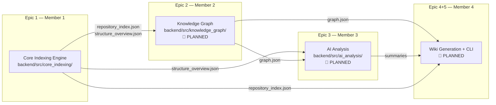

# RepoAtlas — Project Understanding: Modules

> **Document goal:** Understand how the RepoAtlas codebase is divided into modules, what each module's responsibility is, and how they relate to each other.

---

## 1. What Is a Module in RepoAtlas?

In this document, "module" means a **major functional boundary** in the system — a cohesive group of components that share a common domain responsibility. This is distinct from:

| Concept | Meaning |
|---------|---------|
| **Module** | A major functional grouping (e.g., Core Indexing Engine, Knowledge Graph) |
| **Component** | A specific class or file that performs a focused task within a module |
| **Utility** | A shared helper (e.g., `BaseLanguageParser`, `_clean_javadoc`) |
| **Infrastructure** | Build config, test fixtures, package definitions |
| **Shared/Common** | Pydantic models in `models.py` shared across components |

> **Disambiguation note:** The word "module" is overloaded in this project.  
> In the 6-tier AST taxonomy, "Module" refers to a *business-domain boundary* in the analyzed repository.  
> In this document, "module" refers to RepoAtlas's own codebase structure.  
> The distinction is maintained explicitly in each section.

---

## 2. Module Map



---

## 3. Module: Core Indexing Engine

**Status:** ✅ Implemented  
**Owner:** Member 1  
**Location:** `backend/src/core_indexing/`  
**User Stories:** US-1.1, US-1.2, US-1.3, US-1.4

### Responsibility

Transform a raw software repository (local path or Git URL) into a structured, language-agnostic Intermediate Representation (IR) — a unified index of all code symbols and their relationships.

### Main Components

| Component | File | Role |
|-----------|------|------|
| RepositoryScanner | `scanner.py` | Entry point: clone/validate repo, scan files, route to parsers |
| JavaParser | `parsers/java_parser.py` | Parse `.java` files → `FileIndex` with `ASTSymbolNode` list |
| CSharpParser | `parsers/csharp_parser.py` | Parse `.cs` files → `FileIndex` with `ASTSymbolNode` list |
| BaseLanguageParser | `parsers/base.py` | Abstract parser contract + shared utilities |
| RepositoryIndexer | `indexer.py` | Aggregate all `FileIndex` → `RepositoryIndex` + relationships |
| IRGenerator | `ir_generator.py` | Serialize IR to JSON files |
| Unified IR Models | `models.py` | Pydantic schemas shared by all components |
| CLI | `__main__.py` | `python -m core_indexing <path|url> -o indexes/` |

### Input

- A local directory path or a remote Git URL  
- Source files: `.java` (Java) and `.cs` (C#)

### Output

- `indexes/structure.json` — Directory tree representation
- `indexes/repository_index.json` — Full IR: all symbols, relationships, file indexes
- `indexes/structure_overview.json` — Compact 6-tier skeleton (consumed by Chunker)

### Dependencies

| Dependency | Purpose |
|-----------|---------|
| `tree-sitter` | AST parsing engine |
| `tree-sitter-java` | Java grammar for tree-sitter |
| `tree-sitter-c-sharp` | C# grammar for tree-sitter |
| `pydantic` | Schema validation and JSON serialization |
| `pathspec` | `.gitignore` pattern matching |
| `git` (system) | Cloning remote repositories |

### Relationship with Other Modules

- **Provides to Member 2:** `repository_index.json` — the complete IR for Knowledge Graph construction
- **Provides to Member 3:** `structure_overview.json` — the 6-tier skeleton for hierarchical chunking
- **Provides to Member 4:** `repository_index.json` — for symbol cross-linking in wiki pages

### Module Boundary Clarity

> **Observed fact:** The module boundary is clearly defined. `core_indexing` is a self-contained Python package with its own `__init__.py`, `pyproject.toml`, and test suite.

---

## 4. Module: Knowledge Graph

**Status:** 🔲 Not currently implemented — To be implemented  
**Owner:** Member 2  
**Location:** `backend/src/knowledge_graph/` *(directory exists, no implementation code)*  
**User Stories:** US-2.1, US-2.2, US-2.3

### Responsibility

Convert the IR produced by the Core Indexing Engine into a persistent, queryable knowledge graph (`graph.json`) that captures entities (classes, namespaces, modules) and typed relationships (extends, implements, calls, contains).

### Main Components (Planned)

| Component | Role |
|-----------|------|
| Graph Builder | Read `repository_index.json`, construct graph nodes and edges |
| Graph Schema | Define the JSON structure of `graph.json` |
| Query Engine | Load `graph.json` and answer relationship queries |

### Input (Planned)

- `indexes/repository_index.json` (from Core Indexing Engine)

### Output (Planned)

- `graphs/graph.json` — Persistent knowledge graph

### Planned `graph.json` Schema Structure

Based on design documents, the graph is expected to contain:

```json
{
  "nodes": [
    {
      "id": "com.example.auth.UserService",
      "kind": "CLASS",
      "language": "java",
      "file_path": "src/main/java/com/example/auth/UserService.java"
    }
  ],
  "edges": [
    {
      "source": "com.example.auth.UserService",
      "target": "com.example.auth.UserRepository",
      "kind": "uses_field"
    }
  ]
}
```

> ⚠️ The above schema is inferred from IR model types (`RelationshipEdge` in `models.py`) and design documents. The actual `graph.json` schema is **not yet formally defined in source code**.

### Dependencies (Planned)

- Core Indexing Engine output (`repository_index.json`)
- Pydantic or dataclass-based graph schema models

### Relationship with Other Modules

- **Depends on:** Core Indexing Engine (Member 1)
- **Provides to:** AI Analysis (Member 3) — for context enrichment
- **Provides to:** Wiki Generator (Member 4) — as the primary data source for rendering

---

## 5. Module: AI Analysis

**Status:** 🔲 Not currently implemented — To be implemented  
**Owner:** Member 3  
**Location:** `backend/src/ai_analysis/` *(directory structure exists: `llm/`, `taxonomy/`, `tools/` — all empty)*  
**User Stories:** US-3.1, US-3.2, US-3.3, US-3.4, US-3.5

### Responsibility

Generate natural-language summaries of components, modules, and repository architecture using hierarchical AST chunking and an optional LLM (local SLM or remote API).

### Main Components (Planned)

| Component | Role |
|-----------|------|
| Hierarchical Chunker | Structure `structure_overview.json` along 6-tier taxonomy; produce per-level AST skeletons |
| SLM/LLM Client | Communicate with local Ollama inference server or remote API |
| Bottom-Up Summarizer | Orchestrate summarization: Method → Class → Component → Module → Repository |
| No-LLM Fallback | Generate structural summaries from AST data without LLM calls |

### Observed Directory Structure

```
backend/src/ai_analysis/
├── llm/        ← Planned: LLM client and provider adapters
├── taxonomy/   ← Planned: 6-tier taxonomy chunking logic
└── tools/      ← Planned: summarize tool + analysis utilities
```

> **Observed fact:** All three subdirectories exist but contain only `__pycache__` — no implementation code is present.

### Input (Planned)

- `indexes/structure_overview.json` — 6-tier skeleton from Core Indexing Engine
- `graphs/graph.json` — Knowledge Graph from Member 2

### Output (Planned)

- Component summaries
- Module summaries
- Repository architecture summary
- These summaries are passed to the Wiki Generator (Member 4)

### Key Design Principle

> The LLM does **not** read the full repository.

The system feeds **structured evidence** — compact AST skeletons from `structure_overview.json` — into the LLM. Raw source file bodies are loaded lazily only if the SLM explicitly requests deep inspection of a specific method.

This is formalized in **ADR-010** and documented in detail in [docs/designs/hierarchical-prompting-chunking.md](../designs/hierarchical-prompting-chunking.md).

### 6-Tier Taxonomy (Planned)

```
Repository
  └─► Module
        └─► Container
              └─► Component
                    └─► Class
                          └─► Method
```

Summarization flows bottom-up through this hierarchy.

### LLM Configuration Modes (Planned)

| Mode | Description |
|------|-------------|
| Local SLM (default) | Locally hosted model via Ollama; uses strict token limits (<2k/prompt) |
| Remote LLM | Hosted API (e.g., OpenAI, Anthropic); configured via environment |
| No-LLM | Structural documentation generated from AST symbol tables only |

### Relationship with Other Modules

- **Depends on:** Core Indexing Engine (Member 1) — `structure_overview.json`
- **Depends on:** Knowledge Graph (Member 2) — `graph.json`
- **Provides to:** Wiki Generator (Member 4) — descriptive summaries

---

## 6. Module: Wiki Generation + CLI Orchestration

**Status:** 🔲 Not currently implemented — To be implemented  
**Owner:** Member 4  
**Location:** Not yet determined *(planned in `backend/src/` or as standalone package)*  
**User Stories:** US-4.1, US-4.2, US-4.3, US-4.4, US-4.5, US-5.1, US-5.2

### Responsibility

Render the knowledge graph and AI summaries into an interactive, self-contained static HTML documentation site. Provide the unified CLI command that orchestrates the full pipeline.

### Main Components (Planned)

| Component | Role |
|-----------|------|
| HTML Template Compiler | Load Handlebars/Jinja templates; compile pages from `graph.json` + summaries |
| Hyperlink Resolver | Convert FQN references in summaries to relative `symbols/<fqn>.html` links |
| Static Site Writer | Write compiled pages and assets to `wiki/` |
| CLI Orchestrator | `repoatlas analyze <path|url>` — coordinates all 5 pipeline layers |

### Input (Planned)

- `graphs/graph.json` (from Member 2)
- `indexes/repository_index.json` (from Member 1)
- Component/Module/Architecture summaries (from Member 3)

### Output (Planned)

```
wiki/
├── index.html           # Master dashboard
├── tech.html            # Tech stack
├── tests.html           # Test instructions
├── architecture.html    # Architecture diagrams
├── assets/
│   ├── css/main.css
│   └── js/main.js
├── modules/
│   └── <module>.html
└── symbols/
    └── <fqn>.html
```

### Relationship with Other Modules

- **Depends on:** All preceding modules (Core Indexing, Knowledge Graph, AI Analysis)
- **Is the final consumer** — no downstream modules

---

## 7. Module Boundary Assessment

| Module | Boundary Clarity | Evidence |
|--------|-----------------|----------|
| Core Indexing Engine | ✅ Clear | Dedicated Python package, isolated test suite, clear input/output contracts |
| Knowledge Graph | ⚠️ Ambiguous | Directory exists; interface contract not yet defined in code |
| AI Analysis | ⚠️ Ambiguous | Directory structure exists (`llm/`, `taxonomy/`, `tools/`); no implementation |
| Wiki Generation + CLI | ❓ Unclear | No directory or structure visible yet |

**Recommended action for unclear boundaries:**  
Do not restructure the source code. Instead, define and document the interface contracts (input/output schemas) for each planned module before implementation begins.

---

## 8. Shared / Common Code

### `backend/src/core_indexing/models.py`

This file is the **shared schema layer** for the entire pipeline. It defines:

- `ASTSymbolNode` — the universal code symbol representation
- `RepositoryIndex` — the top-level IR consumed by Knowledge Graph and Wiki Generator
- `RelationshipEdge` — the typed edge model feeding the Knowledge Graph
- `FileIndex`, `DirectoryNode`, `ImportInfo` — supporting structures

> **Observed fact:** `models.py` is currently located inside `core_indexing/`. If Knowledge Graph and AI Analysis modules are implemented in separate packages, the shared models may need to be extracted to a common library. This is an architectural consideration for Member 2 and Member 3.

---

## 9. Infrastructure and Tooling

| Category | Details |
|----------|---------|
| Build system | `pyproject.toml` (`backend/`) |
| Dependencies | `requirements.txt` (`tree-sitter`, `pydantic`, `pathspec`) |
| Test framework | `pytest` — 73 tests in `backend/tests/` |
| Test fixtures | `backend/tests/fixtures/` — sample Java and C# source files |

---

## 10. Fact vs. Inference vs. Planned

| Claim | Status |
|-------|--------|
| `core_indexing` is a distinct Python package | ✅ **Observed Fact** |
| `knowledge_graph/` directory exists in `backend/src/` | ✅ **Observed Fact** |
| `knowledge_graph/` has no implementation code | ✅ **Observed Fact** |
| `ai_analysis/` has `llm/`, `taxonomy/`, `tools/` subdirectories | ✅ **Observed Fact** |
| `ai_analysis/` subdirectories have no implementation code | ✅ **Observed Fact** |
| Knowledge Graph consumes `repository_index.json` | 💡 **Inferred** from design docs and IR model comments |
| AI Analysis uses bottom-up summarization | 💡 **Inferred** from `hierarchical-prompting-chunking.md` |
| Wiki Generator uses Handlebars or Jinja templates | 💡 **Inferred** from `html-wiki-storage.md` |
| `models.py` may need extraction to shared package | 💡 **Inferred architectural consideration** |
