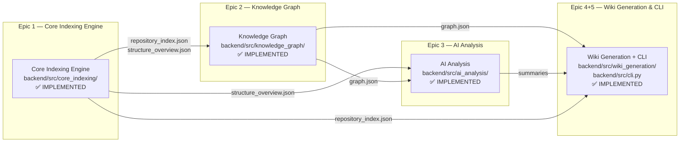

# RepoAtlas — Project Understanding: Modules

> **Document goal:** Understand how the RepoAtlas codebase is divided into modules, what each module's responsibility is, and how they relate to each other.

---

## 1. What Is a Module in RepoAtlas?

In this document, "module" means a **major functional boundary** in the system — a cohesive group of components that share a common domain responsibility. This is distinct from:

| Concept | Meaning |
|---------|---------|
| **Module** | A major functional grouping (e.g., Core Indexing Engine, Knowledge Graph) |
| **Component** | A specific class or file that performs a focused task within a module |
| **Utility** | A shared helper (e.g., `BaseLanguageParser`, `_clean_javadoc`) |
| **Infrastructure** | Build config, test fixtures, package definitions |
| **Shared/Common** | Pydantic models in `models.py` shared across components |

> **Disambiguation note:** The word "module" is overloaded in this project.  
> In the 6-tier AST taxonomy, "Module" refers to a *business-domain boundary* in the analyzed repository.  
> In this document, "module" refers to RepoAtlas's own codebase structure.  
> The distinction is maintained explicitly in each section.

---

## 2. Module Map



---

## 3. Module: Core Indexing Engine

**Status:** ✅ Implemented  
**Owner:** Core Engine Team  
**Location:** `backend/src/core_indexing/`  
**User Stories:** US-1.1, US-1.2, US-1.3, US-1.4

### Responsibility

Transform a raw software repository (local path or Git URL) into a structured, language-agnostic Intermediate Representation (IR) — a unified index of all code symbols and their relationships.

### Main Components

| Component | File | Role |
|-----------|------|------|
| RepositoryScanner | `scanner.py` | Entry point: clone/validate repo, scan files, route to parsers |
| JavaParser | `parsers/java_parser.py` | Parse `.java` files → `FileIndex` with `ASTSymbolNode` list |
| CSharpParser | `parsers/csharp_parser.py` | Parse `.cs` files → `FileIndex` with `ASTSymbolNode` list |
| BaseLanguageParser | `parsers/base.py` | Abstract parser contract + shared utilities |
| RepositoryIndexer | `indexer.py` | Aggregate all `FileIndex` → `RepositoryIndex` + relationships |
| IRGenerator | `ir_generator.py` | Serialize IR to JSON files |
| Unified IR Models | `models.py` | Pydantic schemas shared by all components |
| CLI | `__main__.py` | `python -m core_indexing <path|url> -o indexes/` |

### Input

- A local directory path or a remote Git URL  
- Source files: `.java` (Java) and `.cs` (C#)

### Output

- `indexes/structure.json` — Directory tree representation
- `indexes/repository_index.json` — Full IR: all symbols, relationships, file indexes
- `indexes/structure_overview.json` — Compact 6-tier skeleton (consumed by Chunker)

### Dependencies

| Dependency | Purpose |
|-----------|---------|
| `tree-sitter` | AST parsing engine |
| `tree-sitter-java` | Java grammar for tree-sitter |
| `tree-sitter-c-sharp` | C# grammar for tree-sitter |
| `pydantic` | Schema validation and JSON serialization |
| `pathspec` | `.gitignore` pattern matching |
| `git` (system) | Cloning remote repositories |

---

## 4. Module: Knowledge Graph

**Status:** ✅ Implemented  
**Owner:** Knowledge Graph Team  
**Location:** `backend/src/knowledge_graph/`  
**User Stories:** US-2.1, US-2.2, US-2.3

### Responsibility

Convert the IR produced by the Core Indexing Engine into a persistent, queryable knowledge graph (`graph.json`) that captures entities (classes, namespaces, modules) and typed relationships (extends, implements, calls, contains).

### Main Components

| Component | File | Role |
|-----------|------|------|
| GraphBuilder | `builder.py` | Read `repository_index.json`, construct graph nodes and edges |
| Graph Models | `models.py` | Define `GraphNode`, `GraphEdge`, and `KnowledgeGraph` schemas |
| QueryEngine | `query.py` | Fast lookup for incoming/outgoing dependencies, paths, and neighbors |
| CLI Entrypoint | `__main__.py` | `python -m knowledge_graph build/dependencies/path` |

### Input

- `indexes/repository_index.json` (from Core Indexing Engine)

### Output

- `graphs/graph.json` — Persistent knowledge graph

### `graph.json` Schema Structure

```json
{
  "nodes": [
    {
      "id": "com.example.auth.UserService",
      "kind": "CLASS",
      "language": "java",
      "file_path": "src/main/java/com/example/auth/UserService.java"
    }
  ],
  "edges": [
    {
      "source": "com.example.auth.UserService",
      "target": "com.example.auth.UserRepository",
      "kind": "uses_field"
    }
  ]
}
```

---

## 5. Module: AI Analysis

**Status:** ✅ Implemented  
**Owner:** AI & Context Team  
**Location:** `backend/src/ai_analysis/`  
**User Stories:** US-3.1, US-3.2, US-3.3, US-3.4, US-3.5

### Responsibility

Generate natural-language summaries of components, modules, and repository architecture using hierarchical AST chunking and an optional LLM (local SLM via Ollama `qwen2.5-coder:3b` or No-LLM fallback).

### Main Components

| Component | File | Role |
|-----------|------|------|
| Hierarchical Chunker | `chunker.py` | Structure `structure_overview.json` along 6-tier taxonomy; produce per-level AST skeletons |
| OllamaClient / NullLLM | `llm/ollama.py`, `llm/null.py` | Local Ollama client (`qwen2.5-coder:3b`) and deterministic offline fallback |
| BottomUpSummarizer | `summarizer.py` | Orchestrate summarization: Method → Class → Component → Module → Repository |
| Content Extractor | `content.py` | Lazy source file reader and signature extractor |

### Directory Structure

```
backend/src/ai_analysis/
├── chunker.py      # 6-Tier AST taxonomy chunking logic
├── content.py      # Source code reading & signature extraction
├── summarizer.py   # Bottom-up summarizer orchestrator
└── llm/            # LLM clients (Ollama SLM + NullLLM fallback)
```

### Input

- `indexes/structure_overview.json` — 6-tier skeleton from Core Indexing Engine
- `graphs/graph.json` — Knowledge Graph

### Output

- `analysis/summaries.json` — Component, module, and system summaries

---

## 6. Module: Wiki Generation & CLI Orchestration

**Status:** ✅ Implemented  
**Owner:** Frontend & Core CLI Team  
**Location:** `backend/src/wiki_generation/` and `backend/src/cli.py`  
**User Stories:** US-4.1 – US-4.6, US-5.1 – US-5.2

### Responsibility

Render the knowledge graph and AI summaries into an interactive, static Material 3 HTML documentation site. Provide the single-command CLI (`repoatlas analyze <path|url>`) that orchestrates all 5 layers.

### Main Components

| Component | File | Role |
|-----------|------|------|
| WikiRenderer | `renderer.py` | Load Jinja2 templates; compile static HTML pages & `search_index.json` |
| Jinja2 Templates | `templates/` | M3 static layout templates (`base.html`, `index.html`, `architecture.html`, `modules.html`, `tech.html`, `tests.html`, `symbol.html`) |
| Ask Local AI Widget | `templates/base.html` | Floating Local AI Chat Widget connected to Ollama and client-side hybrid index search |
| CLI Orchestrator | `cli.py` | Single entrypoint command (`repoatlas analyze <path|url>`) coordinating scan, parse, build, analyze, render |

### Output Structure

```
wiki/
├── index.html           # Master overview dashboard with Bento Grid
├── tech.html            # Tech stack and environment breakdown
├── tests.html           # Test suite instructions and runners
├── architecture.html    # System layers and component diagrams
├── modules.html         # 3-Column multi-tier structural taxonomy
├── symbols/*.html       # AST Class & Method detail pages
└── search_index.json    # Fast client-side search & Local AI context index
```

---

## 7. Module Boundary Assessment

| Module | Boundary Clarity | Evidence |
|--------|-----------------|----------|
| Core Indexing Engine | ✅ Clear | Dedicated Python package `backend/src/core_indexing/`, isolated unit tests |
| Knowledge Graph | ✅ Clear | Dedicated Python package `backend/src/knowledge_graph/`, verified test suite |
| AI Analysis | ✅ Clear | Dedicated Python package `backend/src/ai_analysis/`, verified test suite |
| Wiki Generation + CLI | ✅ Clear | Package `backend/src/wiki_generation/` + `cli.py` CLI orchestrator |

---

## 8. Shared / Common Code

### `backend/src/core_indexing/models.py`

This file is the **shared schema layer** for the entire pipeline. It defines:

- `ASTSymbolNode` — universal code symbol schema
- `RepositoryIndex` — top-level IR consumed by Knowledge Graph and Wiki Generator
- `RelationshipEdge` — typed edge model feeding Knowledge Graph
- `FileIndex`, `DirectoryNode`, `ImportInfo` — supporting structures

---

## 9. Infrastructure and Tooling

| Category | Details |
|----------|---------|
| Build system | `pyproject.toml` (`backend/`) |
| Dependencies | `requirements.txt` (`tree-sitter`, `pydantic`, `pathspec`, `httpx`) |
| Test framework | `pytest` — 289+ passing unit and integration tests |
| Test fixtures | `backend/tests/fixtures/` — Java & C# code fixtures |

---

## 10. Fact vs. Inference vs. Implemented

| Claim | Status |
|-------|--------|
| `core_indexing` is a distinct Python package | ✅ **Fact** |
| `knowledge_graph` is fully implemented | ✅ **Fact** |
| `ai_analysis` contains 6-tier chunker & Ollama summarizer | ✅ **Fact** |
| `wiki_generation` renders Jinja2 M3 static HTML site & Local AI Widget | ✅ **Fact** |
| Single CLI `repoatlas analyze <path|url>` orchestrates pipeline | ✅ **Fact** |
| 289+ unit & integration tests pass cleanly | ✅ **Fact** |

