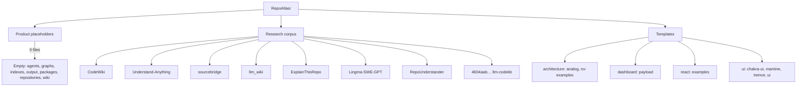
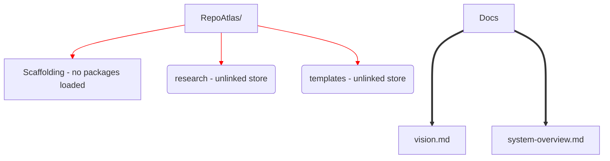

# RepoAtlas — Repository Analysis

> Scope note: RepoAtlas *itself* is analyzed here. Where a category can only describe the **vendored third-party corpus** (research/templates), it is explicitly attributed to that corpus and marked accordingly. Product capabilities that don't exist are **Not Determined**.

## 1. Repository Structure

Analyzed folders/files, with counts (verified):

| Path | Files | Nature |
|---|---|---|
| `agents/` | 0 | product placeholder (empty) |
| `graphs/` | 0 | product placeholder (empty) |
| `indexes/` | 0 | product placeholder (empty) |
| `output/` | 0 | product placeholder (empty) |
| `packages/` | 0 | product placeholder (empty) |
| `repositories/` | 0 | product placeholder (empty) |
| `wiki/` | 0 | product placeholder (empty) |
| `research/` | 15,403 | vendored third-party reference repos + empty `notes/`, `papers/` |
| `templates/` | 26,892 | vendored UI/framework scaffolding |
| `docs/` (workspace root) | 2 | authored design docs (`vision.md`, `system-overview.md`) |

### Top-level anatomy

**Conclusion (Confirmed):** This is a pre-implementation workspace — a taxonomy + research library + template stock, with no product source.

## 2. Build System

**Not Determined for RepoAtlas product.**

- No `Makefile`, `package.json`, `pyproject.toml`, `go.mod`, build scripts, or CI workflow files exist in/under the empty product folders.
- The vendored corpus carries its own third‑party build tooling (`turborepo`, `pnpm`, `Makefile` in `sourcebridge`), which is out of scope for RepoAtlas itself.

## 3. Framework Detection

**Not Determined** — no framework is used by RepoAtlas. The research corpus demonstrates candidate tech (Python/Go/TS agent stacks), and the `templates/ui/**` are React/Next/Vite/Astro scaffolding, but none is RepoAtlas technology.

## 4. Configuration Analysis

| Scope | Result |
|---|---|
| Product config (env, CLI, config files) | **Not Determined** — none present |
| Reference configs in corpus | third‑party `.env.example`, `config.toml.example` (sourcebridge), `conf/` (Lingma) — attributed to vendored projects only |

No product configuration can be inferred.

## 5. Entry Points

**Not Determined.** There is no `main`, `cli`, `bin`, entrypoint module, or server for RepoAtlas.

## 6. Package Analysis

- No RepoAtlas package exists (no `packages/` content). The label `packages/` implies intended behavior package(s).
- `templates/ui/ui/packages` reflect shadcn‑style component packages — third‑party.

## 7. Dependency Analysis

| Level | Detail |
|---|---|
| Product dependencies | **None observed** — no manifests at product level |
| Bundled/vendored | 70,000+ files committed under `research/` + `templates/` (to‑date uncommitted, still `A` staged). These are duplicate dependencies/lockfiles from ~15 external projects. |
| Git semantics | One commit (`5b89a0 first commit`); all vendored content staged but never committed — meaning the "shipping" hasn't happened. |

### Module/package dependency graph (as‑is)

## 8. Layer Analysis

**Not Determined as implemented.** Layers* exist only as naming:

- Candidates (from design docs): repository → index → graph → agent → wiki (data plane); CLI/API (experience plane).
- Verified empty `directories`.

---

## Summary Table

| Analysis axis | Determined? | Conclusion |
|---|---|---|
| Structure | Determined | scaffolding + research corpus + templates; no product. |
| Build system | Not Determined | no build for RepoAtlas. |
| Framework | Not Determined | none for RepoAtlas. |
| Config | Not Determined | none. |
| Entry point | Not Determined | none. |
| Packages | Not Determined | none. |
| Dependencies | Determined (vendored) | 42k+ files of third‑party code unlinked to product. |
| Layers | Not Determined | only taxonomy names. |