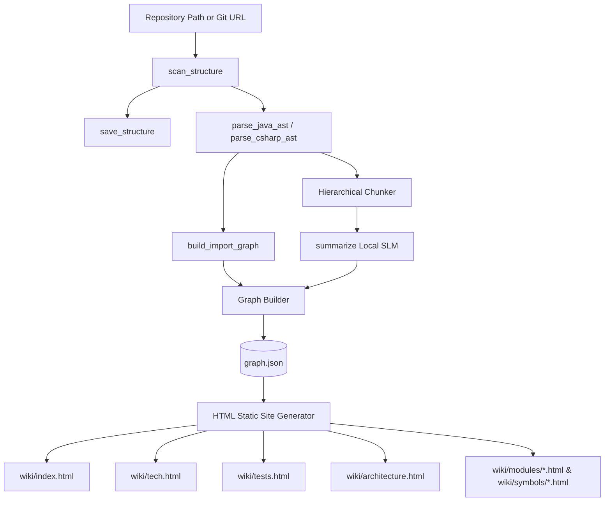

# RepoAtlas — System Overview

## System Components

| Component         | Responsibility                                                                                             |
| ----------------- | ---------------------------------------------------------------------------------------------------------- |
| **Input**         | Accept a local repository path or Git URL and prepare it for analysis.                                     |
| **Indexer**       | Parse the repository into structured metadata using a fixed set of analysis tools.                         |
| **Analysis**      | Use an optional LLM (local or remote) to generate descriptions from the repository structure and metadata. |
| **Graph Builder** | Build a knowledge graph from the extracted metadata and analysis results, then store it as `graph.json`.   |
| **Generator**     | Generate the wiki documents from the knowledge graph.                                                      |
| **CLI**           | Provide a single command-line entry point: `repoatlas analyze <path\|url>`.                                |

## Analysis Tools

RepoAtlas provides a fixed set of analysis tools for repository indexing and documentation generation.

| Tool                 | Purpose                                                                    | Notes                                              |
| -------------------- | -------------------------------------------------------------------------- | -------------------------------------------------- |
| `scan_structure`     | Scan the repository and build the directory and file structure.            | Read-only                                          |
| `save_structure`     | Save the scanned structure to a local file such as `index/structure.json`. | Used during current execution                      |
| `read_file`          | Read repository files with configurable size and line limits.              | Used for manifests and configuration files         |
| `parse_java_ast`     | Parse Java files into structured AST nodes and extract metadata.           | Language-specific parser (JavaParser/Tree-sitter)  |
| `parse_csharp_ast`   | Parse C# files into structured AST nodes and extract metadata.             | Language-specific parser (Roslyn/Tree-sitter)      |
| `build_import_graph` | Build dependency and symbol call graphs from extracted AST nodes.          | Used for Architecture and Modules documentation    |
| `summarize`          | Generate natural-language summaries via bottom-up hierarchical chunking.    | Invokes local SLM with AST skeletons               |

All tools are read-only and operate only on the analyzed repository.

## LLM Configuration

RepoAtlas supports three execution modes:

- **Local SLM (default)** — A locally hosted small language model (e.g. Llama 3 8B, Phi-3), using 6-tier AST chunking to optimize context usage.
- **Remote LLM** — A hosted language model accessed through a configured API endpoint.
- **No LLM** — Structural documentation is generated strictly from AST symbol tables and graph analysis.

## Processing Pipeline

```text
Input (Repository Path or URL)
        │
        ▼
scan_structure & save_structure
        │
        ▼
parse_java_ast / parse_csharp_ast
        │
        ▼
build_import_graph (Symbol Index & Call Graph)
        │
        ▼
Hierarchical Chunker (6-Tier Taxonomy)
        │
        ▼
summarize (Local SLM Bottom-Up Summarization)
        │
        ▼
Graph Builder ──► graph.json
        │
        ▼
HTML Static Site Generator
        │
        ▼
wiki/ Output Bundle (index.html, tech.html, architecture.html, etc.)
```

## Data Flow



## Documentation Generation

### Architecture

The Architecture view is generated from the repository structure, symbol table, and import/call graph. Architectural layers are identified via AST package/namespace clustering, after which the local SLM produces concise layer descriptions guided by AST skeletons.

### Modules & Symbols

Modules are identified by grouping AST nodes according to container and component boundaries. For each class/interface node, detailed AST views (`symbols/<fqn>.html`) are rendered with dynamic breadcrumbs (`Repository > Module > Container > Component > Class > Method`) and cross-referencing hyperlinks.

## Design Decisions

1. The knowledge graph is stored as a file (`graph.json`) rather than a service.
2. Repository analysis is performed once per execution using a bounded workflow.
3. The analysis toolset is fixed and consists of five read-only tools.
4. LLM support is optional, with local execution as the default.
5. Repository changes are handled through complete re-analysis.
6. The application is provided exclusively as a CLI tool.

## Summary

RepoAtlas analyzes a repository using five fixed tools, builds a knowledge graph (`graph.json`), optionally enriches the results with an LLM, and generates four wiki documents: **Tech**, **Tests**, **Architecture**, and **Modules**. The system intentionally remains lightweight, deterministic, and centered around a single CLI workflow.
