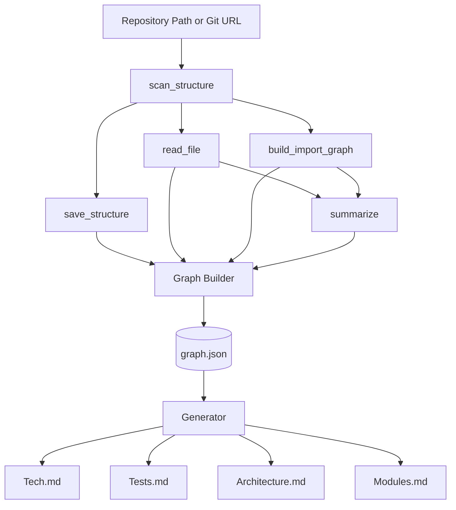

# RepoAtlas — System Overview

## System Components

| Component         | Responsibility                                                                                             |
| ----------------- | ---------------------------------------------------------------------------------------------------------- |
| **Input**         | Accept a local repository path or Git URL and prepare it for analysis.                                     |
| **Indexer**       | Parse the repository into structured metadata using a fixed set of analysis tools.                         |
| **Analysis**      | Use an optional LLM (local or remote) to generate descriptions from the repository structure and metadata. |
| **Graph Builder** | Build a knowledge graph from the extracted metadata and analysis results, then store it as `graph.json`.   |
| **Generator**     | Generate the wiki documents from the knowledge graph.                                                      |
| **CLI**           | Provide a single command-line entry point: `repoatlas analyze <path\|url>`.                                |

## Analysis Tools

RepoAtlas provides a small, fixed set of tools for repository analysis.

| Tool                 | Purpose                                                                    | Notes                                              |
| -------------------- | -------------------------------------------------------------------------- | -------------------------------------------------- |
| `scan_structure`     | Scan the repository and build the directory and file structure.            | Read-only                                          |
| `save_structure`     | Save the scanned structure to a local file such as `index/structure.json`. | Used only during the current execution             |
| `read_file`          | Read repository files with configurable size and line limits.              | Used for manifests and representative source files |
| `build_import_graph` | Build an import/dependency graph from source code.                         | Used for Architecture and Modules documentation    |
| `summarize`          | Generate natural-language summaries from structural information.           | The only tool that invokes an LLM                  |

All tools are read-only and operate only on the analyzed repository. No plugin system, permission model, or policy layer is required.

## LLM Configuration

RepoAtlas supports three execution modes:

- **Local LLM (default)** — A locally hosted model, such as one served through Ollama or another compatible inference server.
- **Remote LLM** — A hosted language model accessed through a configured API endpoint.
- **No LLM** — Structural documentation is still generated, while descriptive sections are omitted or simplified.

The selected mode is controlled through a single configuration option.

## Processing Pipeline

```text
Input (Repository Path or URL)
        │
        ▼
scan_structure
        │
        ▼
save_structure
        │
        ▼
read_file
        │
        ▼
build_import_graph
        │
        ▼
summarize (optional)
        │
        ▼
Graph Builder
        │
        ▼
graph.json
        │
        ▼
Generator
        │
        ▼
Tech.md
Tests.md
Architecture.md
Modules.md
```

Running the command again performs a complete analysis and regenerates both the knowledge graph and the wiki documentation.

## Data Flow



## Documentation Generation

### Architecture

The Architecture document is generated from the repository structure and the import graph. Repository layers and major architectural components are identified through heuristic analysis, after which the LLM optionally produces concise descriptions for each identified component.

### Modules

Modules are identified by grouping related files based on import relationships and directory organization. The LLM optionally summarizes the purpose and responsibilities of each module. For repositories containing distinct frontend and backend sections, the Generator may present specialized views such as Components or MVC while using the same underlying graph.

## Design Decisions

1. The knowledge graph is stored as a file (`graph.json`) rather than a service.
2. Repository analysis is performed once per execution using a bounded workflow.
3. The analysis toolset is fixed and consists of five read-only tools.
4. LLM support is optional, with local execution as the default.
5. Repository changes are handled through complete re-analysis.
6. The application is provided exclusively as a CLI tool.

## Summary

RepoAtlas analyzes a repository using five fixed tools, builds a knowledge graph (`graph.json`), optionally enriches the results with an LLM, and generates four wiki documents: **Tech**, **Tests**, **Architecture**, and **Modules**. The system intentionally remains lightweight, deterministic, and centered around a single CLI workflow.
