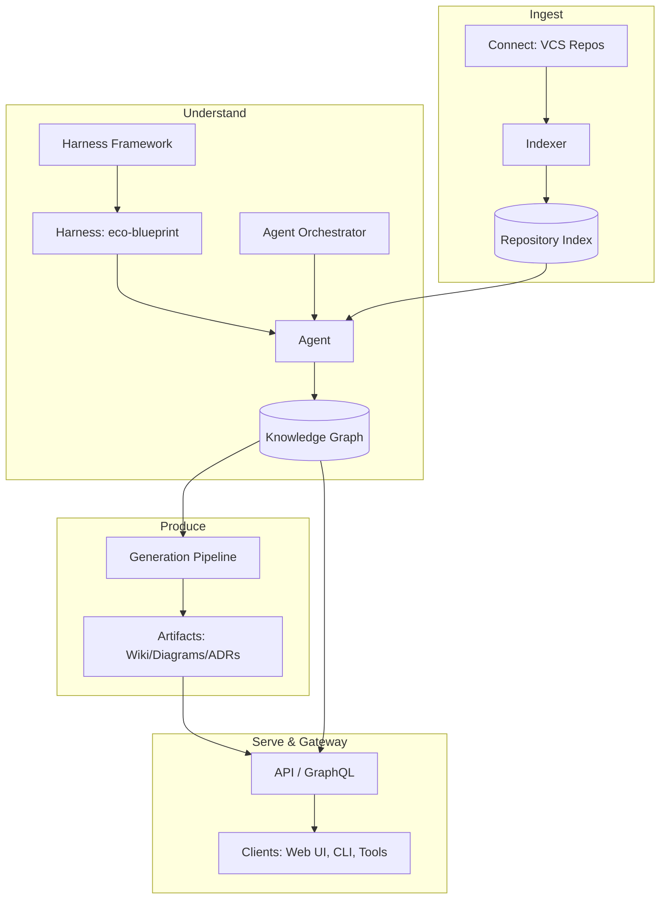

# RepoAtlas — System Overview

## Purpose

The System Overview describes, at whole-system level, what RepoAtlas is and how its major parts interact to produce repository intelligence. It sits one level below the Project Vision: the Vision defines *why* and the System Overview defines *how the pieces fit* at a coarse, pipe-to-subsystem level. It is the orienting map behind all deeper documents (High-Level Architecture, Harness Architecture, Agent Architecture, Workflow, Knowledge Graph, Indexing, Wiki Generation, Storage).

## Responsibilities

- Define the **system boundary** and the major subsystems.
- Describe the **primary data flow** and the end-to-end cycle.
- Identify the **key interfaces** and how data travels between subsystems.
- Clarify **who consumes the system** and through which surfaces.
- Map the **Core Concepts** defined in `vision.md` to concrete subsystems.
- Give the reader a **stable, convention-level glossary** they can hold while reading the deeper docs.

---

## System Constituents

| Subsystem | Core Concept Realized | Primary Responsibility |
|---|---|---|
| **Indexer** | Repository Index | Parse a Repository into structured metadata: files, symbols, dependencies, tests. |
| **Integration / Connect** | Repository | Connect to Version Control hosts to fetch repository metadata and content. |
| **Knowledge Graph Service** | Knowledge Graph | Store, query, and version the canonical graph of entities and relationships. |
| **Harness Framework** | Harness | Define, store, load, and run reusable ecosystem-templated analysis capabilities. |
| **Agent Orchestration** | Agent | Operate agents that orchestrate Harnesses to explore and validate; refresh graph. |
| **Generation Pipeline** | Artifact | Produce Wiki, diagrams, ADRs, and summaries from graph truth. |
| **Gateway / API** | Global | Serve queries and artifact retrieval to humans/tools. |
| **Control Plane / Config** | Global | Manage Workspaces, scheduling, providers, policy, and freshness. |
| **Storage Layer** | Global | Persistence for the Index, Graph, Artifacts, and configuration. |

## The Core Cycle (End-to-End)

RepoAtlas runs a closed loop around the Knowledge Graph:

```text
Connect -> Index -> Harness Up -> Analyze -> Commit -> Generate -> Serve
                                                                    ^
                                                    +--> Refresh (delta) --+
```

1. **Connect** — pull repository metadata/content from a VCS.
2. **Index** — parse into the raw Repository Index.
3. **Setup** — identify ecosystem and select/set up the matching Harness.
4. **Analyze** — an Agent runs the Harness to extract intent, entities, and relationships.
5. **Commit** — validated findings merge into the Knowledge Graph (the single source of truth).
6. **Generate** — the Generation Pipeline synthesizes Artifacts from the graph.
7. **Serve** — users query the graph or browse artifacts via the API/web/CI.
8. **Refresh** — on code deltas, review Agents detect and re-run parts of the cycle; the loop stays current.

## Data Flow Diagram



## Primary Interfaces

| From | To | Interaction Summary |
|---|---|---|
| Connect | Indexer | Supply raw repository metadata/content. |
| Indexer | Repository Index | Commit structured parse results. |
| Harness Framework | Agent | Provide reusable blueprints/prompts/heuristics. |
| Agent | Repository Index + Knowledge Graph | Query/extract; read context; write validated facts. |
| Knowledge Graph | Generation Pipeline | Provide canonical truth for rendering artifacts. |
| Generation Pipeline | Facts | Author |
| Generation | Artifacts | Produce Wiki, diagrams and ADRs. |
| Knowledge Graph | API | Answer relationship-aware queries. |
| API | Web UI / CLI | Serve artifacts and graph query results. |

## Key Design Decisions

1. **Knowledge Graph is the backbone (single source of truth).** All artifacts (Wiki, diagrams, ADRs) are derived, never authoritative; the graph is authority. This guarantees consistency across outputs.
2. **Separation of Harness (how) from Agent (who).** This restates analysis accuracy, repeatability, and reusability against different ecosystems.
3. **Model-agnostic.** No hard-coded LLM/embedding vendor; providers are pluggable so the system coordinates *capabilities*, not *vendors*.
4. **Delta-based incremental analysis, not full-repo reprocessing by default.** Keeps cost sustainable at hundreds of repositories.
5. **Self-hostable default.** Operators control data; the open-source ethos holds and privacy of code is preserved.

## Assumptions

- Repositories are git-based (or another detectable VCS) with ecosystem signals to pick a Harness.
- An LLM provider and an embedding provider are accessible (remote or local); absent models produce graceful weight as structural/analysis-only mode.
- Operator infrastructure (self-husted or cloud) runs engine components and stores results.
- Interaction happens through CLI/API; optional web UI for visualization/gen MDD is feasible in a letter phase.
- Arbiters/agents run on the operator's infra.

## Future Improvements

- **Global/Cross-Repo Graph** — blend many repositories into one shared graph deduping shared architecture.
- **Chat Assistant** — natural language Q&A over the graph with citations.
- **Graph Explorer UI** — interactive visualization in a web-surface.
- **Change-Impact Insights** — autonomous explanation of cascade effects of a change.
- **Multi-model routing** — cost/latency/privacy aware routing across providers per task type.
- **Governance panels** — freshness, coverage, and accuracy metrics per workspace.

## Summary

RepoAtlas is a closed loop built around one canonical graph: **Connect → Index → Setup Harness → Analyze → Validate → Generate → Serve → Refresh.** The graph is the backbone; Harnesses give reusable "how;" Agents drive active, honest analysis; artifacts (Wiki, etc.) are derived and kept current by a refresh loop. The result is self-hostable, pluggable-in-AI repository intelligence that delivers value from the first generated Wiki.