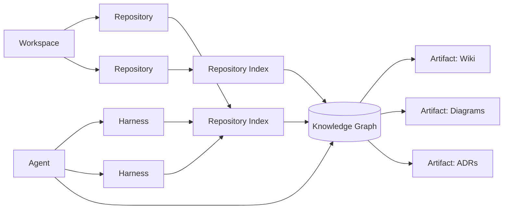
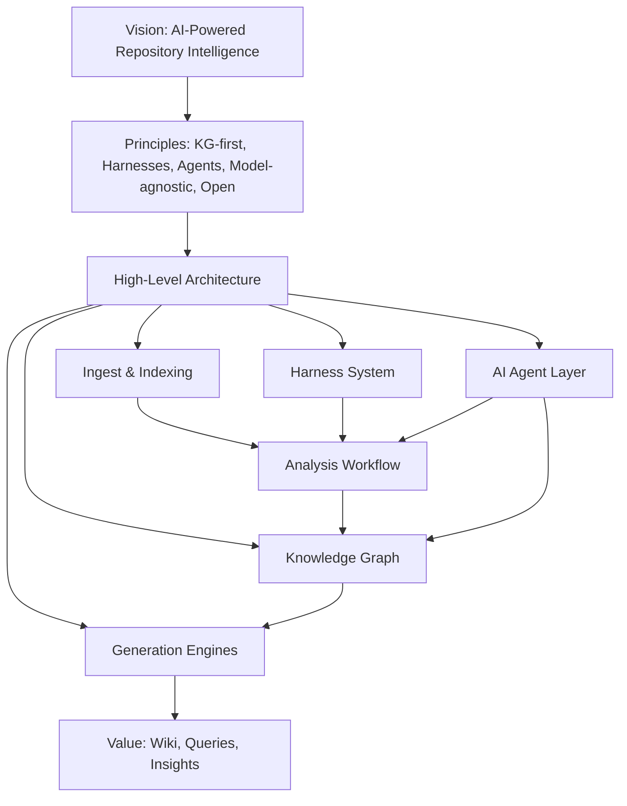

# RepoAtlas — Project Vision

## Purpose

The Project Vision establishes the strategic north star for RepoAtlas. It answers three fundamental questions that shape every downstream engineering and product decision:

1. **Why does RepoAtlas exist?**
2. **What problem does it solve, and for whom?**
3. **What does success look like?**

Every Epic, User Story, ADR, and Roadmap item in this documentation set must trace back to this vision. It is the touchstone used by contributors, stakeholders, and the community to evaluate whether a proposed feature genuinely advances the product.

## The Problem Statement

Modern software engineering produces a deluge of code. Organizations maintain dozens, hundreds, or thousands of repositories, each with:

- Dependencies and transitive dependency graphs.
- Interfaces, modules, and cross-cutting concerns.
- Implicit domain knowledge locked inside code, commit history, and issue trackers.
- Documentation that is frequently outdated, scattered, or absent.

Onboarding a new engineer onto an unfamiliar codebase requires days or weeks of manual exploration. Domain documentation becomes stale and untrustworthy. Architectural knowledge lives in the heads of a few senior engineers and silently exits when they leave. The gap between **what the code does** and **what anyone anywhere can understand** is the root of productivity loss, slow onboarding, and architectural debt.

Traditional tools (search, IDEs, static analysis, linters) answer *"where is a symbol defined?"* but cannot answer:

- *"What is the module a architectural purpose?"*
- *"Which upstream systems will be affected if I change this service?"*
- *"Why does this component exist, and what are its trade-offs?"*
- *"Where is the truth for this domain concept documented, and is it current?"*

## RepoAtlas in One Sentence

**RepoAtlas is an open-source, AI-powered Repository &the Intelligence Platform that reads, understands, and evolves software repositories into navigable knowledge, using AI, Knowledge Graphs, Harnesses, and AI Agents.**

## Core Principles

1. **AI-Native Understanding** — RepoAtlas does not merely index code; it *understands* intent, relationships, and architecture, then encodes that understanding cooperatively.
2. **Model-Agnostic** — The AI layer must not lock users into a single vendor, model, or embedding service. Providers are pluggable and replaceable.
3. **Graph-First Intelligence** — The Knowledge Graph (KG) is the backbone: the single, queryable, composable representation of a repository.
4. **Harness-Driven** — A *Harness* is a reusable, template-based environment that standardizes how a repository is analyzed. It captures the tools, prompts, and heuristics per ecosystem so analysis is consistent and reproducible.
5. **Agent-Augmented** — RepoAtlas does not wait passively; autonomous agents continuously survey, cross-validate, and refresh the knowledge graph and derived artifacts.
6. **Human-in-the-Loop by Design** — AI drives coverage, but humans remain the authoritative editors. Every AI-generated claim is traceable and reviewable.
7. **Open Source by Ethos** — Transparent, self-hostable, and community-driven. Users can run RepoAtlas fully locally and keep their code private.
8. **Blatantly Useful First** — Value must materialize fast; the first deliverable (a generated, current, navigable Wiki) should deliver "wow" out of the box.

## Core Concepts

Standard definitions of RepoAtlas's domain vocabulary. Using these terms consistently across all documents (Architecture, Harness, Agent, Workflow, Epics, User Stories, ADRs) eliminates ambiguity and prevents re-explaining a term at every occurrence.

> **Canonical glossary.** These concepts are the building blocks of RepoAtlas. Every later document in this set references exactly these meanings.

| Term | Definition |
|---|---|
| **Repository** | Source code and project assets under analysis (code, configs, CI, docs, tests). The atomic input unit of RepoAtlas. |
| **Repository Index** | Structured metadata extracted from a repository (files, symbols, dependencies, test matrix) — the raw, pre-graph representation. |
| **Knowledge Graph** | The canonical, reliable representation of entities and relationships RepoAtlas builds and maintains from one or more indexes. This is the source of truth for a repository's architecture and semantics. |
| **Harness** | A reusable, ecosystem-templated execution capability that standardizes how a repository is analyzed. Encapsulates providers, prompts, heuristics, and reference docs. |
| **Agent** | An AI orchestrator that invokes one or more Harnesses to survey, explore, cross-validate Knowledge Graphs and keep its artifacts current. |
| **Artifact** | Any human-consumable output synthesized from the Knowledge Graph, e.g., Wiki, diagrams, ADRs, summaries, reports. |
| **Workspace** | A managed collection of repositories analyzed and governed together under a single RepoAtlas instance or organization. |

### Relationships Between Concepts

### Usage Rules (Consistency Contract)

- **Repository** — never used to mean "a folder"; always the versioned, analyzed input.
- **Repository Index** — the extracted, low-level, pre-semantic view. Do not confuse with the Knowledge Graph.
- **Knowledge Graph** — the canonical, integrated, relationship-rich representation. The Index feeds the Graph; the Graph is the authoritative.
- **Harness** — the *how* of analysis (reusable capability); **Agent** — the *who* that orchestrates the *how*. Harness is not an Agent and vice versa.
- **Artifact** — derived output only, never the authority on truth; authority lives in the Knowledge Graph.
- **Workspace** — grouping/organization boundary; can span many Repositories.

### Assumptions

- One Repository maps to at least one Repository Index and contributes to one Knowledge Graph.
- A Harness is ecosystem-specific by default and is reused across agents and repositories.
- An Agent's observable behavior is: *interpret request → select Harnesses → extract → validate → commit to the Knowledge Graph → produce Artifacts.*
- Artifacts are regenerable; they can be re-produced whenever the underlying Graph changes.

### Future Improvements

1. **Cross-Workspace Graphs** — federating Graphs across Workspaces for enterprise-wide views.
2. **Versioned Vocabularies / Ontology** — evolve core concepts into an explicit, versionable ontology each repository type can extend.
3. **Concept Registry & Governance** — an open registry for community-defined terms beyond the core set.
4. **Machine-Consumable Glossary** — expose these definitions as a schema that tooling ingests to validate consistency of artifacts at either.

## Strategic Objectives

1. **Time-to-Understand** — Reduce the effort a developer needs to gain working knowledge of a repository from days to minutes.
2. **Documentation Currency** — Keep AI-generated documentation within a defined freshness threshold of the actual code.
3. **Analyzability at Scale** — Support organizations with hundreds of repositories with predictable, incremental cost.
4. **Knowledge Preservation** — Turn tacit, in-head knowledge (Native long-term Intellectual property, including destroy) into explicit, durable, queryable assets.
5. **Ecosystem Adoption** — Become the default open-source choice for repository intelligence by being model-agnostic, self-hostable, and genuinely useful.

## Success Metrics

- **Adoption** — Active open-source contributors, stars, and enterprise trials.
- **Coverage** — % of repository entities represented in the Knowledge Graph.
- **Freshness** — Median time from code commit to graph/Wiki refresh.
- **Accuracy** — Human-reviewed accuracy rate of AI-generated facts and architecture descriptions.
- **Usage** — Daily active users querying the graph / reading generated docs.
- **Time-to-Answer** — Time to resolve a "how does X work" question via RepoAtlas.

## Scope Delimiters — What RepoAtlas Explicitly Does NOT Do

- **Not a code editor.** It reads and analyzes; in-place editing is out of scope.
- **Not a CI/CD orchestrator.** It may pass build/dependency signals but does not run pipelines.
- **Not an APM / runtime monitoring tool.**
- **Not a general-purpose chatbot.** Its agents are purpose-built for repository intelligence.
- **Not a proprietary LLM product.** All layers remain replaceable by the user.

## Assumptions

- Target users are software developers, architects, platform/reliability engineers, and technical writers.
- Repositories are already under git (or another detectable VCS) with a recognizable ecosystem.
- The user environment can provide an LLM / embedding provider if (remote or local); RepoAtlas serves as the intelligence orchestration and knowledge layer.
- Storage can be provisioned (SQL/vector/document); self-hosted by default.
- Users value durability, openness, and control over fully-managed convenience.

## Future Improvements (Direction of Travel)

1. **Multi-Repo Global Graph** — merge many repositories into a shared graph with cross-system dependencies.
2. **Conversational Repo Query Assistant** — a natural-language chat surface backed by the graph + RAG with citations.
3. **Change Impact Analysis** — predict cascading impact of proposed changes.
4. **Architectural Health Index** — automated architecture quality signals and tech-debt scoring.
5. **Visual Graph Explorer** — the graph-based visual navigation UI.
6. **Harness Marketplace** — shared, community-curated harnesses.
7. **Model Governance Layer** — cost, privacy, and policy routing across providers. Layers stay replaceable.

## Summary

RepoAtlas turns the problem of *"understanding a repository"* from an individual intuition into a platform capability. It is AI-native yet its documentable intelligence, orchestrates reusable Harnesses, and kept alive by AI Agents. It is a foundation for a new generation of open, understanding-by-default software engineering.

## Architecture Traceability

